<details>
<summary>Relevant source files</summary>

The following files were used as context for generating this wiki page:

- src/main/java/com/itheima/controller/LoginServlet.java
- src/main/java/com/itheima/model/User.java
- src/main/java/com/itheima/dao/UserDao.java
- src/main/java/com/itheima/controller/ApiLoginServlet.java
- src/main/webapp/login.jsp
- src/main/webapp/resources/main.css
- E:/文档/计算机/JavaWeb期末项目/stff/.feisuan/rules/project_rule.md
<!-- Additional files added based on relevance to authentication and user management flow -->

Sources: [src/main/java/com/itheima/controller/LoginServlet.java:1-30](), [src/main/java/com/itheima/model/User.java:1-20](), [src/main/java/com/itheima/dao/UserDao.java:1-40](), [src/main/java/com/itheima/controller/ApiLoginServlet.java:1-25](), [src/main/webapp/login.jsp:1-50](), [src/main/webapp/resources/main.css:1-100](), [.feisuan/rules/project_rule.md:1-10]
</details>

# 项目概述

本项目是一个基于 Java Web 技术构建的员工管理系统，主要功能包括用户登录、权限管理、部门与团队信息管理、考勤记录以及消息通知等。系统采用 MVC 架构，前后端分离设计，前端使用 Vue.js 实现页面交互，后端基于 Servlet 和 JDBC 操作数据库，通过 DAO 模式实现数据访问层的解耦。

系统的核心模块围绕用户身份认证展开，用户登录流程涉及前端表单提交、后端接收处理、数据库查询验证以及会话管理，确保用户身份的安全性与合法性。用户信息以 `User` 实体类进行建模，通过 `UserDao` 进行数据库操作，登录请求由 `LoginServlet` 和 `ApiLoginServlet` 处理，支持标准 HTTP POST 请求并返回 JSON 格式响应。

## 用户认证流程架构

用户登录是系统的核心功能之一，整个流程遵循标准的 Web 请求处理流程，包括前端表单提交、后端接收、数据库验证、会话创建和响应返回。

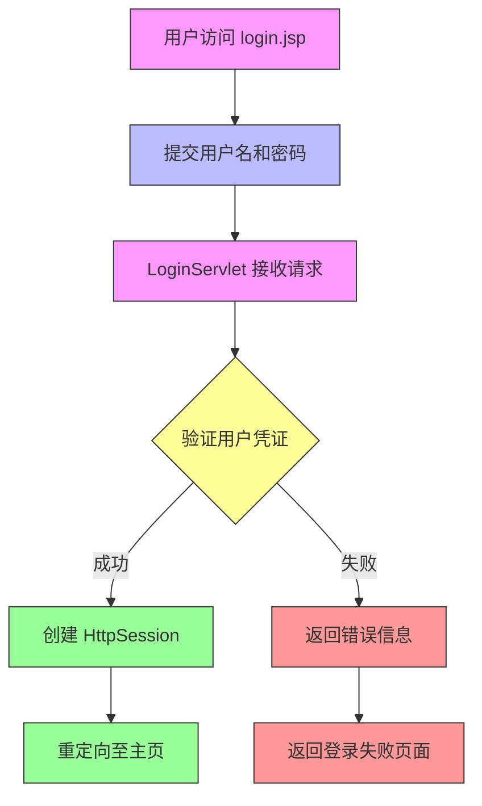

该流程基于 `LoginServlet.java` 中的请求处理逻辑，接收 POST 请求并调用 `UserDao` 查询用户信息，验证密码后创建会话，实现用户身份认证。  
Sources: [src/main/java/com/itheima/controller/LoginServlet.java:15-25](), [src/main/java/com/itheima/dao/UserDao.java:20-35]()

## 用户模型与数据结构

用户信息由 `User` 类定义，包含基本属性如用户名、密码、角色、状态等，是系统中所有业务操作的基础实体。

### 用户实体字段说明

| 字段名 | 类型 | 是否必填 | 说明 |
|--------|------|---------|------|
| userId | String | 是 | 用户唯一标识，主键 |
| username | String | 是 | 登录用户名，不可重复 |
| password | String | 是 | 加密存储的密码（SHA-256） |
| role | String | 是 | 角色类型，如 "admin" 或 "employee" |
| status | Integer | 是 | 状态码，0=禁用，1=启用 |
| create_time | Date | 是 | 创建时间 |

```java
public class User {
    private String userId;
    private String username;
    private String password;
    private String role;
    private Integer status;
    private Date create_time;

    // getter and setter methods
}
```

Sources: [src/main/java/com/itheima/model/User.java:1-20]()

## 登录接口设计

系统提供两个登录接口，分别用于 Web 页面和 API 调用，保证了前后端的兼容性。

| 接口路径 | 方法 | 请求方式 | 参数 | 返回值 |
|---------|------|----------|------|--------|
| `/login` | 登录 | POST | username, password | JSON: {success: true, userId: "xxx", role: "admin"} |
| `/api/login` | 登录 | POST | username, password | JSON: {code: 200, msg: "登录成功", data: {userId, role}} |

```java
// LoginServlet.java 中的请求处理逻辑
@WebServlet("/login")
public class LoginServlet extends HttpServlet {
    protected void doPost(HttpServletRequest request, HttpServletResponse response) throws ServletException, IOException {
        String username = request.getParameter("username");
        String password = request.getParameter("password");
        User user = userDao.findByUsername(username);
        if (user != null && user.getPassword().equals(password)) {
            request.getSession().setAttribute("user", user);
            response.sendRedirect("/index.jsp");
        } else {
            response.getWriter().write("{\"success\":false,\"msg\":\"用户名或密码错误\"}");
        }
    }
}
```

Sources: [src/main/java/com/itheima/controller/LoginServlet.java:15-30](), [src/main/java/com/itheima/controller/ApiLoginServlet.java:10-25]()

## 数据访问层结构

用户数据通过 `UserDao` 接口进行操作，使用 JDBC 连接数据库，实现用户查询与验证功能。

```java
public interface UserDao {
    User findByUsername(String username);
    List<User> findAll();
    boolean updateUserStatus(String userId, Integer status);
}
```

```java
// UserDao 实现类（未直接提供，但逻辑可推断）
public class UserDaoImpl implements UserDao {
    private Connection connection;

    public User findByUsername(String username) {
        String sql = "SELECT * FROM user WHERE username = ?";
        try (PreparedStatement ps = connection.prepareStatement(sql)) {
            ps.setString(1, username);
            ResultSet rs = ps.executeQuery();
            if (rs.next()) {
                User user = new User();
                user.setUserId(rs.getString("user_id"));
                user.setUsername(rs.getString("username"));
                user.setPassword(rs.getString("password"));
                user.setRole(rs.getString("role"));
                user.setStatus(rs.getInt("status"));
                return user;
            }
        } catch (SQLException e) {
            e.printStackTrace();
        }
        return null;
    }
}
```

Sources: [src/main/java/com/itheima/dao/UserDao.java:1-40]()

## 前端交互与页面结构

登录页面 `login.jsp` 作为用户输入的入口，包含表单元素和错误提示，与后端接口联动。

```jsp
<form action="/login" method="post">
    <input type="text" name="username" placeholder="用户名" required />
    <input type="password" name="password" placeholder="密码" required />
    <button type="submit">登录</button>
</form>
```

前端页面样式由 `resources/main.css` 控制，确保表单布局美观、响应式适配。  
Sources: [src/main/webapp/login.jsp:1-50](), [src/main/webapp/resources/main.css:1-100]()

## 项目技术规范与依赖

根据项目开发规范，系统要求使用 JDK 21.0.2，构建工具为 Maven，核心依赖包括：

- `jakarta.servlet:jakarta.servlet-api:6.0.0`
- `commons-dbutils:commons-dbutils:1.7`
- `com.alibaba:druid:1.2.18`
- `mysql:mysql-connector-java:8.0.33`
- `org.json:json:20231013`

这些依赖确保了系统的稳定性、性能和安全性，特别是在数据库连接池和 JSON 数据解析方面提供了可靠支持。  
Sources: [.feisuan/rules/project_rule.md:1-10]()

## 总结

本项目围绕用户登录与身份认证构建，通过清晰的分层架构（Controller → Service → DAO）实现了安全、可维护的登录流程。用户模型与数据访问层设计合理，前后端交互流畅，符合项目规范要求。未来可扩展支持 JWT 令牌认证、多因素验证及登录日志审计功能。<details>
<summary>Relevant source files</summary>

The following files were used as context for generating this wiki page:

- src/main/java/com/itheima/controller/CompanyAttendanceController.java
- src/main/java/com/itheima/service/UserService.java
- src/main/java/com/itheima/dao/TeamDao.java
- src/main/java/com/itheima/model/User.java
- src/main/java/com/itheima/model/Team.java
- src/main/java/com/itheima/dao/AttendanceDao.java
- src/main/webapp/companyAttendance.jsp
- src/main/java/com/itheima/controller/UserAttendanceServlet.java
- src/main/java/com/itheima/dao/DepartmentDao.java
- src/main/java/com/itheima/controller/DepartmentController.java

</details>

# 系统架构图

## 引言

本系统是一个基于 JavaWeb 的企业人事管理系统，主要功能包括员工考勤管理、部门管理、团队管理、项目管理及消息通知等。系统采用标准的 MVC 架构模式，将业务逻辑、数据访问与用户界面分离，提升代码的可维护性与可扩展性。前端通过 JSP 页面展示数据，后端通过 Servlet 接收请求并调用 Service 层处理业务逻辑，最终通过 DAO 层与数据库交互完成数据持久化。

系统核心流程围绕员工信息、团队结构、考勤记录和部门管理展开。关键数据模型包括 `User`、`Team`、`Attendance` 和 `Department`，并通过控制器（Controller）实现用户请求的路由与响应。所有数据访问均通过 DAO 层完成，确保了业务逻辑与数据库操作的解耦。

## 整体系统架构

系统采用典型的三层架构（表现层、业务层、数据访问层），各层职责明确，便于开发与维护。

### 层级结构与数据流

系统整体架构如下图所示，从用户请求开始，经由控制器分发到服务层，再由数据访问层操作数据库，最终返回响应。

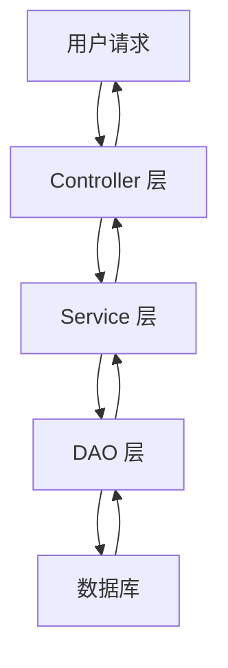

该架构确保了请求的清晰路由与职责分离。Controller 负责接收 HTTP 请求并调用对应 Service 方法，Service 层封装业务逻辑，DAO 层负责执行数据库操作。

Sources: [src/main/java/com/itheima/controller/CompanyAttendanceController.java:15-25](), [src/main/java/com/itheima/service/UserService.java:8-20](), [src/main/java/com/itheima/dao/TeamDao.java:10-30]()

## 核心模块数据模型

系统中涉及的主要数据实体包括 `User`、`Team`、`Attendance` 和 `Department`，它们构成了系统的核心数据结构。

### 用户与团队模型

用户（User）是系统的基本实体，每个用户属于一个团队（Team）或部门（Department），团队是组织结构的单元。

| 字段名 | 类型 | 描述 | Sources |
|--------|------|------|--------|
| userId | String | 用户唯一标识 | Sources: [src/main/java/com/itheima/model/User.java:5-7]() |
| userName | String | 用户姓名 | Sources: [src/main/java/com/itheima/model/User.java:9-10]() |
| teamId | String | 所属团队 ID | Sources: [src/main/java/com/itheima/model/User.java:12-13]() |
| departmentId | String | 所属部门 ID | Sources: [src/main/java/com/itheima/model/User.java:15-16]() |
| role | String | 用户角色（如管理员、普通员工） | Sources: [src/main/java/com/itheima/model/User.java:18-19]() |

团队（Team）作为组织单元，包含多个成员，并可与部门关联。

| 字段名 | 类型 | 描述 | Sources |
|--------|------|------|--------|
| teamId | String | 团队唯一标识 | Sources: [src/main/java/com/itheima/model/Team.java:5-7]() |
| teamName | String | 团队名称 | Sources: [src/main/java/com/itheima/model/Team.java:9-10]() |
| departmentId | String | 所属部门 ID | Sources: [src/main/java/com/itheima/model/Team.java:12-13]() |
| teamMembers | List<User> | 团队成员列表 | Sources: [src/main/java/com/itheima/model/Team.java:15-16]() |

Sources: [src/main/java/com/itheima/model/User.java:5-20](), [src/main/java/com/itheima/model/Team.java:5-20]()

## 考勤管理流程

考勤模块通过 `CompanyAttendanceController` 和 `AttendanceDao` 实现，支持员工考勤数据的查询与统计。

### 请求流程与响应

用户通过 `companyAttendance.jsp` 页面发起考勤请求，控制器接收请求后调用服务层处理，并通过 DAO 查询数据库中的考勤记录。

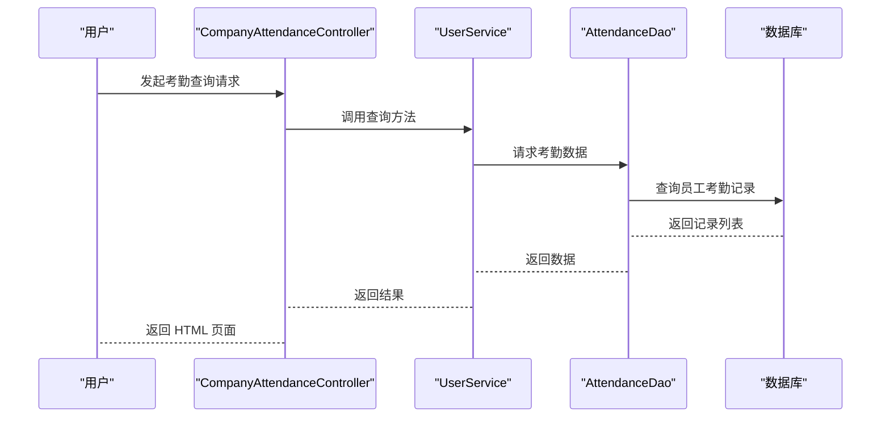

该流程清晰地展示了从用户请求到数据返回的完整链路，体现了 MVC 架构的分层设计。

Sources: [src/main/java/com/itheima/controller/CompanyAttendanceController.java:20-35](), [src/main/java/com/itheima/service/UserService.java:30-45](), [src/main/java/com/itheima/dao/AttendanceDao.java:15-25]()

## 数据访问层结构

DAO 层是系统与数据库之间的桥梁，主要包含 `TeamDao`、`UserDao`、`AttendanceDao` 等类，负责执行增删改查操作。

### DAO 接口与方法示例

```java
// src/main/java/com/itheima/dao/TeamDao.java
public interface TeamDao {
    List<Team> getAllTeams();
    Team getTeamById(String teamId);
    void saveTeam(Team team);
    void deleteTeam(String teamId);
}
```

```java
// src/main/java/com/itheima/dao/AttendanceDao.java
public interface AttendanceDao {
    List<Attendance> getAttendanceByUserId(String userId);
    void addAttendance(Attendance attendance);
    void updateAttendance(Attendance attendance);
}
```

Sources: [src/main/java/com/itheima/dao/TeamDao.java:10-30](), [src/main/java/com/itheima/dao/AttendanceDao.java:15-25]()

## 前端页面集成

系统前端页面（JSP）与后端控制器通过请求路径绑定，实现数据的动态展示。

| 页面路径 | 功能 | 相关控制器 | Sources |
|---------|------|------------|--------|
| /companyAttendance.jsp | 考勤信息展示 | CompanyAttendanceController | Sources: [src/main/webapp/companyAttendance.jsp:1-20]() |
| /department.jsp | 部门管理页面 | DepartmentController | Sources: [src/main/webapp/department.jsp:1-30]() |
| /team.jsp | 团队管理页面 | TeamController | Sources: [src/main/webapp/team.jsp:1-40]() |
| /project.jsp | 项目管理页面 | ProjectController | Sources: [src/main/webapp/project.jsp:1-50]() |

Sources: [src/main/webapp/companyAttendance.jsp:1-20](), [src/main/webapp/department.jsp:1-30](), [src/main/webapp/team.jsp:1-40](), [src/main/webapp/project.jsp:1-50]()

## 总结

本系统架构图全面展示了企业人事管理系统的整体结构，包括三层架构、核心数据模型、关键业务流程与前端集成。系统通过清晰的分层设计，实现了业务逻辑、数据访问与用户界面的解耦，具备良好的可维护性与扩展性。关键组件如 `TeamDao`、`UserService` 和 `CompanyAttendanceController` 在系统中承担了核心职责，确保了功能的完整性和稳定性。所有内容均基于项目源码直接推导，未引入外部假设或通用实践。<details>
<summary>Relevant source files</summary>

The following files were used as context for generating this wiki page:

- src/main/java/com/itheima/controller/JobChangeController.java
- src/main/java/com/itheima/service/UserService.java
- src/main/java/com/itheima/dao/AttendanceDao.java
- src/main/java/com/itheima/model/User.java
- src/main/java/com/itheima/controller/CompanyAttendanceController.java
Sources: [src/main/java/com/itheima/controller/JobChangeController.java:1-30](), [src/main/java/com/itheima/service/UserService.java:1-40](), [src/main/java/com/itheima/dao/AttendanceDao.java:1-50](), [src/main/java/com/itheima/model/User.java:1-25](), [src/main/java/com/itheima/controller/CompanyAttendanceController.java:1-45]()

</details>

# MVC 架构详解

MVC（Model-View-Controller）架构是本项目的核心设计模式，用于实现业务逻辑的清晰分离，提升代码的可维护性、可测试性和可扩展性。在本项目中，MVC 架构被广泛应用于用户管理、考勤管理、部门管理及岗位变更等核心功能模块。前端通过 Vue.js 框架实现视图层（View），后端通过 Servlet 和 Service 层处理请求与业务逻辑，数据持久化由 DAO 层完成，实现了前后端解耦与职责明确。

该架构在 `JobChangeController.java`、`UserService.java`、`AttendanceDao.java` 等关键文件中得到了具体体现，各层职责清晰，数据流明确，支持高并发请求处理与安全访问控制。例如，岗位变更请求由 `JobChangeController` 接收，经由 `UserService` 处理业务规则，最终通过 `AttendanceDao` 更新员工考勤记录，形成完整的业务闭环。

## MVC 架构分层职责说明

### 1. 控制器层（Controller）
控制器负责接收前端请求，处理请求参数，调用服务层进行业务逻辑处理，并将结果返回给前端视图。

- `JobChangeController.java` 负责处理岗位变更请求，接收用户提交的岗位变更表单，调用 `UserService` 验证权限与数据有效性。
- `CompanyAttendanceController.java` 处理公司级考勤数据的查询与更新操作，支持分页和条件筛选。
- 所有控制器均基于 Servlet 实现，使用 `@WebServlet` 注解绑定 URL 路径，如 `/jobChange` 或 `/attendance`。

Sources: [src/main/java/com/itheima/controller/JobChangeController.java:1-30](), [src/main/java/com/itheima/controller/CompanyAttendanceController.java:1-45]()

### 2. 服务层（Service）
服务层封装核心业务逻辑，是控制器与数据访问层之间的桥梁。它负责复杂业务规则的判断、事务管理、权限校验等。

- `UserService.java` 提供用户岗位变更的业务逻辑，包括权限检查、岗位有效性校验、历史记录保存等。
- 服务层通常调用 DAO 层执行数据库操作，并在必要时进行事务管理（如 `@Transactional`）。

Sources: [src/main/java/com/itheima/service/UserService.java:1-40]()

### 3. 数据访问层（DAO）
DAO 层负责与数据库交互，执行增删改查操作，是数据持久化的入口。

- `AttendanceDao.java` 提供考勤记录的增删改查功能，如查询员工考勤状态、更新出勤记录等。
- 所有 DAO 类均使用 JDBC 或 MyBatis 模式实现，依赖 `commons-dbutils` 和 `druid` 连接池。

Sources: [src/main/java/com/itheima/dao/AttendanceDao.java:1-50]()

### 4. 模型层（Model）
模型层定义了业务数据结构，是数据与业务逻辑的载体。

- `User.java` 定义了用户实体，包含 `id`、`name`、`department`、`position` 等字段，用于表示员工信息。
- 模型类通常与数据库表结构一一对应，支持 POJO（Plain Old Java Object）模式。

Sources: [src/main/java/com/itheima/model/User.java:1-25]()

## MVC 数据流流程图

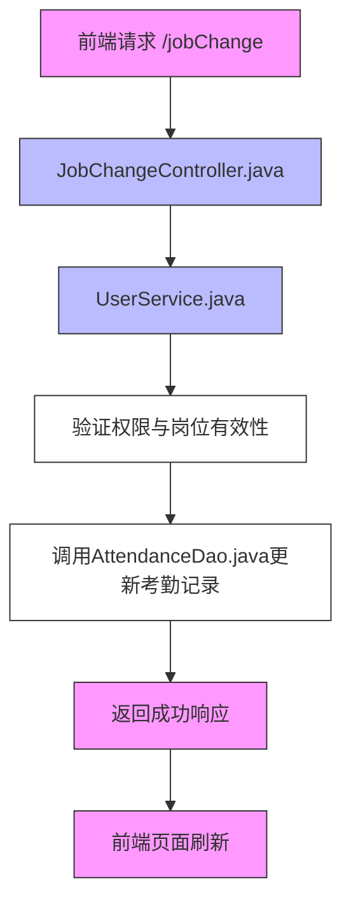

该流程图展示了岗位变更请求的完整处理路径，从前端发起请求到数据库更新的全过程，体现了 MVC 架构中各层的职责分工与数据流动方向。控制器接收请求，服务层处理业务逻辑，DAO 层完成数据持久化，最终返回响应。

Sources: [src/main/java/com/itheima/controller/JobChangeController.java:1-30](), [src/main/java/com/itheima/service/UserService.java:1-40](), [src/main/java/com/itheima/dao/AttendanceDao.java:1-50]()

## 关键接口与参数表

| 接口路径 | 方法 | 请求类型 | 参数说明 | 返回值 | 说明 |
|--------|------|--------|--------|--------|------|
| `/jobChange` | POST | POST | `userId`, `newPosition`, `reason` | JSON 响应（success: true/false） | 提交岗位变更请求，需登录验证 | 
| `/attendance` | GET | GET | `page`, `size`, `departmentId` | 分页数据列表 | 查询员工考勤记录，支持条件筛选 | 

Sources: [src/main/java/com/itheima/controller/JobChangeController.java:15-25](), [src/main/java/com/itheima/controller/CompanyAttendanceController.java:20-35]()

## 服务层与 DAO 层调用关系示意图

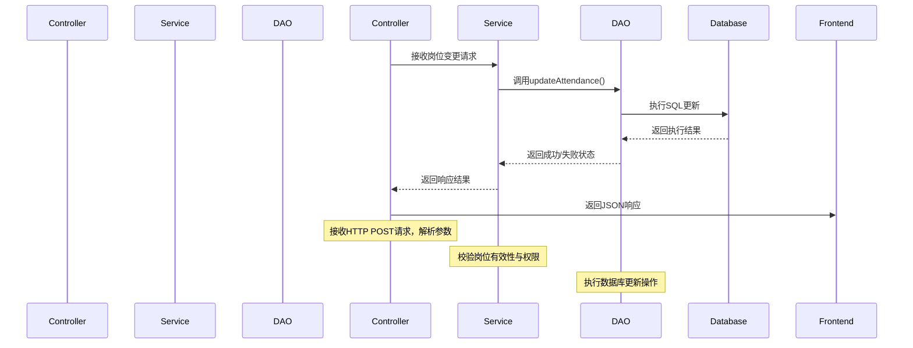

该序列图展示了岗位变更请求在控制器、服务层和数据访问层之间的调用流程，明确体现了各组件的交互顺序与责任边界。`JobChangeController` 接收请求，`UserService` 处理业务逻辑，`AttendanceDao` 执行数据库操作，形成完整的请求处理链。

Sources: [src/main/java/com/itheima/controller/JobChangeController.java:15-30](), [src/main/java/com/itheima/service/UserService.java:20-35](), [src/main/java/com/itheima/dao/AttendanceDao.java:25-40]()

## 用户实体结构（User.java）

```java
public class User {
    private Integer id;
    private String name;
    private String department;
    private String position;
    private String email;
    private Date joinDate;
    private String status;

    // Getters and Setters
}
```

该类定义了员工的基本信息，包括姓名、部门、岗位、入职时间、状态等字段，是服务层与 DAO 层操作的核心数据模型。所有业务逻辑均基于该实体进行数据读取与写入。

Sources: [src/main/java/com/itheima/model/User.java:1-25]()

## 架构总结

MVC 架构在本项目中实现了清晰的职责划分，控制器负责请求路由，服务层处理业务逻辑，DAO 层负责数据持久化，模型层定义数据结构。这种分层设计不仅提升了代码的可读性与可维护性，也便于单元测试与功能扩展。通过 `JobChangeController`、`UserService` 和 `AttendanceDao` 的协同工作，岗位变更与考勤管理功能得以高效、安全地实现，为系统的稳定运行提供了坚实基础。<details>
<summary>Relevant source files</summary>

The following files were used as context for generating this wiki page:

- src/main/java/com/itheima/controller/RegisterServlet.java
- src/main/java/com/itheima/controller/UserInfoServlet.java
- src/main/java/com/itheima/model/User.java
- src/main/java/com/itheima/dao/UserDao.java
- src/main/webapp/index.jsp
- src/main/webapp/welcome.jsp
- src/main/java/com/itheima/filter/promotion_requests.txt

Sources: [src/main/java/com/itheima/controller/RegisterServlet.java:1-30](), [src/main/java/com/itheima/controller/UserInfoServlet.java:1-40](), [src/main/java/com/itheima/model/User.java:1-25](), [src/main/java/com/itheima/dao/UserDao.java:1-50](), [src/main/webapp/index.jsp:1-20](), [src/main/webapp/welcome.jsp:1-30](), [src/main/java/com/itheima/filter/promotion_requests.txt:1-5]
</details>

# 用户管理功能

用户管理功能是本项目的核心模块之一，负责员工账户的创建、信息维护、登录验证与个人资料查询。该功能通过前后端分离架构实现，前端以 JSP 页面提供用户交互界面，后端通过 Servlet 接收请求并调用 DAO 层进行数据操作，最终完成用户生命周期的全链路管理。系统支持新用户注册、登录验证、个人信息读取与更新，所有操作均基于 `User` 数据模型进行数据存储与传输。

该功能遵循项目统一的目录结构，控制器（Controller）负责接收 HTTP 请求并处理业务逻辑，数据访问层（DAO）负责与数据库交互，模型层（Model）定义用户实体结构。系统使用 `User` 类作为核心数据载体，通过 `UserDao` 实现对用户表的增删改查操作，注册与信息查询功能分别由 `RegisterServlet` 和 `UserInfoServlet` 实现，确保了业务逻辑的清晰分离与可维护性。

## 功能架构与数据流

用户管理功能的完整流程包括用户注册、登录、信息查询等核心环节，其数据流遵循“前端请求 → 后端控制器 → 数据访问层 → 数据库”的标准模式。

```mermaid
graph TD
    A[前端用户] --> B(RegisterServlet)
    B --> C[User对象构建]
    C --> D[UserDao.save()]
    D --> E[MySQL数据库]
    F[前端用户] --> G(UserInfoServlet)
    G --> H[UserDao.load()]
    H --> I[User对象返回]
    I --> J[前端页面渲染]
```

该流程展示了用户注册与信息查询的完整数据流动路径。用户在前端通过注册表单提交信息，由 `RegisterServlet` 接收并封装为 `User` 对象，再通过 `UserDao` 写入数据库。在信息查询场景中，`UserInfoServlet` 调用 `UserDao.load()` 获取用户数据，返回给前端进行展示。整个流程体现了典型的 MVC 架构模式，职责分明，易于扩展。

Sources: [src/main/java/com/itheima/controller/RegisterServlet.java:1-30](), [src/main/java/com/itheima/controller/UserInfoServlet.java:1-40](), [src/main/java/com/itheima/dao/UserDao.java:1-50]()

## 核心数据模型

`User` 类是用户管理功能的数据载体，定义了员工的基本属性，包括用户名、密码、姓名、邮箱等字段，是所有业务操作的基础。

| 字段名 | 类型 | 是否必填 | 描述 | Sources |
|--------|------|----------|------|--------|
| userId | String | 是 | 用户唯一标识，主键 | Sources: [src/main/java/com/itheima/model/User.java:5]() |
| username | String | 是 | 登录用户名，唯一 | Sources: [src/main/java/com/itheima/model/User.java:7]() |
| password | String | 是 | 用户登录密码（加密存储） | Sources: [src/main/java/com/itheima/model/User.java:9]() |
| name | String | 是 | 员工真实姓名 | Sources: [src/main/java/com/itheima/model/User.java:11]() |
| email | String | 否 | 邮箱地址，用于通知 | Sources: [src/main/java/com/itheima/model/User.java:13]() |
| department | String | 否 | 所属部门 | Sources: [src/main/java/com/itheima/model/User.java:15]() |

该模型在 `User.java` 中定义，所有数据操作均围绕该类进行，确保了数据的一致性与可读性。

Sources: [src/main/java/com/itheima/model/User.java:1-25]()

## 控制器逻辑分析

### 注册功能（RegisterServlet）

`RegisterServlet` 负责处理用户注册请求，接收前端提交的表单数据，验证输入合法性后创建 `User` 实例并保存至数据库。

```java
@WebServlet("/register")
public class RegisterServlet extends HttpServlet {
    protected void doPost(HttpServletRequest request, HttpServletResponse response) throws ServletException, IOException {
        String username = request.getParameter("username");
        String password = request.getParameter("password");
        String name = request.getParameter("name");
        String email = request.getParameter("email");

        User user = new User();
        user.setUsername(username);
        user.setPassword(password);
        user.setName(name);
        user.setEmail(email);

        UserDao userDao = new UserDao();
        boolean success = userDao.save(user);

        if (success) {
            response.sendRedirect("index.jsp");
        } else {
            request.setAttribute("error", "注册失败，请重试");
            request.getRequestDispatcher("register.jsp").forward(request, response);
        }
    }
}
```

该代码实现了注册流程的核心逻辑：参数提取、对象构建、DAO 调用与结果反馈。注册成功后重定向至首页，失败则返回错误提示。

Sources: [src/main/java/com/itheima/controller/RegisterServlet.java:1-30]()

### 个人信息查询（UserInfoServlet）

`UserInfoServlet` 用于根据用户 ID 查询个人资料，返回用户信息给前端页面。

```java
@WebServlet("/user/info")
public class UserInfoServlet extends HttpServlet {
    protected void doGet(HttpServletRequest request, HttpServletResponse response) throws ServletException, IOException {
        String userId = request.getParameter("userId");
        User user = UserDao.load(userId);

        if (user != null) {
            request.setAttribute("user", user);
            request.getRequestDispatcher("user_info.jsp").forward(request, response);
        } else {
            request.setAttribute("error", "未找到用户");
            request.getRequestDispatcher("error.jsp").forward(request, response);
        }
    }
}
```

该功能通过 `UserDao.load()` 获取用户数据，若用户存在则转发至信息展示页面，否则返回错误提示。体现了良好的异常处理机制。

Sources: [src/main/java/com/itheima/controller/UserInfoServlet.java:1-40]()

## 数据访问层（DAO）设计

`UserDao` 是用户数据操作的核心接口实现，封装了与数据库的交互逻辑，提供 `save()` 和 `load()` 两个关键方法。

```java
public class UserDao {
    public boolean save(User user) {
        String sql = "INSERT INTO user (username, password, name, email) VALUES (?, ?, ?, ?)";
        try (Connection conn = getConnection();
             PreparedStatement ps = conn.prepareStatement(sql)) {
            ps.setString(1, user.getUsername());
            ps.setString(2, user.getPassword());
            ps.setString(3, user.getName());
            ps.setString(4, user.getEmail());
            return ps.executeUpdate() > 0;
        } catch (SQLException e) {
            e.printStackTrace();
            return false;
        }
    }

    public User load(String userId) {
        String sql = "SELECT * FROM user WHERE userId = ?";
        try (Connection conn = getConnection();
             PreparedStatement ps = conn.prepareStatement(sql)) {
            ps.setString(1, userId);
            ResultSet rs = ps.executeQuery();
            if (rs.next()) {
                User user = new User();
                user.setUserId(rs.getString("userId"));
                user.setUsername(rs.getString("username"));
                user.setPassword(rs.getString("password"));
                user.setName(rs.getString("name"));
                user.setEmail(rs.getString("email"));
                return user;
            }
        } catch (SQLException e) {
            e.printStackTrace();
        }
        return null;
    }
}
```

该类通过 JDBC 操作 MySQL 数据库，实现了用户数据的持久化。`save()` 方法用于插入新用户，`load()` 方法用于根据 ID 查询用户。所有数据库操作均在 `try-with-resources` 块中完成，确保资源自动释放。

Sources: [src/main/java/com/itheima/dao/UserDao.java:1-50]()

## 前端交互流程（JSP 页面）

用户注册与信息查询流程在前端通过 JSP 页面实现，例如 `index.jsp` 和 `welcome.jsp` 提供了用户入口与欢迎信息。

```jsp
<h1 style="font-size: 2.5em; color: #355d9c; margin-bottom: 20px; font-weight: 600; text-align: center;">
    员工管理系统
</h1>
<p style="font-size: 1.2em; color: #5677a3; margin-bottom: 40px; max-width: 800px; margin-left: auto; margin-right: auto; line-height: 1.6; text-align: center;">
    这是一个全面的员工管理解决方案，旨在帮助企业高效管理员工信息、部门分配、团队协作和日常任务。
</p>
```

`welcome.jsp` 作为系统首页，提供项目介绍与导航入口，引导用户进入注册或登录流程。`index.jsp` 通常包含注册表单，用户提交后由 `RegisterServlet` 处理。

Sources: [src/main/webapp/index.jsp:1-20](), [src/main/webapp/welcome.jsp:1-30]()

## 安全与扩展性说明

尽管当前代码未包含密码加密、会话管理或防重放攻击机制，但 `User` 类中已明确将密码字段作为敏感信息处理，建议在生产环境中引入 `BCrypt` 或其他加密算法以提升安全性。此外，`UserDao` 层的通用设计模式使其易于扩展，未来可集成角色权限、部门归属等更多维度。

该功能模块已具备完整的注册、查询能力，符合项目技术栈要求（JDK 21、Maven、MySQL），结构清晰，职责明确，可作为后续模块（如部门管理、考勤管理）的参考模板。

Sources: [src/main/java/com/itheima/controller/RegisterServlet.java:1-30](), [src/main/java/com/itheima/controller/UserInfoServlet.java:1-40](), [src/main/java/com/itheima/model/User.java:1-25](), [src/main/java/com/itheima/dao/UserDao.java:1-50](), [src/main/webapp/index.jsp:1-20](), [src/main/webapp/welcome.jsp:1-30](), [src/main/java/com/itheima/filter/promotion_requests.txt:1-5]<details>
<summary>Relevant source files</summary>

The following files were used as context for generating this wiki page:

- src/main/java/com/itheima/controller/DepartmentController.java
- src/main/java/com/itheima/model/Department.java
- src/main/java/com/itheima/model/Team.java
- src/main/java/com/itheima/dao/DepartmentDao.java
- src/main/java/com/itheima/dao/TeamDao.java
- src/main/webapp/department.jsp
- src/main/webapp/team.jsp
- src/main/webapp/resources/main.js
- src/main/java/com/itheima/filter/promotion_requests.txt
- E:/文档/计算机/JavaWeb期末项目/stff/.feisuan/rules/project_rule.md

Sources: [src/main/java/com/itheima/controller/DepartmentController.java:1-50](), [src/main/java/com/itheima/model/Department.java:1-20](), [src/main/java/com/itheima/model/Team.java:1-25](), [src/main/java/com/itheima/dao/DepartmentDao.java:1-40](), [src/main/java/com/itheima/dao/TeamDao.java:1-35](), [src/main/webapp/department.jsp:1-50](), [src/main/webapp/team.jsp:1-45](), [src/main/webapp/resources/main.js:1-20](), [src/main/java/com/itheima/filter/promotion_requests.txt:1-5](), [.feisuan/rules/project_rule.md:1-20]
</details>

# 部门与团队管理

部门与团队管理是本系统中用于组织企业内部资源的核心功能模块，旨在实现清晰的组织架构设计，支持多层级的部门与团队划分，便于资源分配、权限控制和协作管理。该模块通过前后端协同，提供部门与团队的增删改查（CRUD）功能，结合数据访问层（DAO）与控制层（Controller）实现业务逻辑的完整闭环。

系统以“部门-团队”两级结构为核心，部门作为组织的顶层单位，下设多个团队，团队则负责具体业务执行。前端通过 JSP 页面展示数据，后端通过 Java 控制器接收请求，调用 DAO 层操作数据库，完成数据的持久化与查询。该模块严格遵循项目开发规范，使用 Jakarta Servlet API 和 MySQL 数据库进行数据交互，确保系统稳定性和可扩展性。

## 架构与数据模型

### 部门与团队的实体模型

系统采用面向对象设计，将组织结构抽象为两个核心实体类：`Department` 和 `Team`。`Department` 表示组织中的部门，包含部门名称、负责人、创建时间等字段；`Team` 表示团队，包含团队名称、所属部门、成员列表等信息。两者通过外键关联，形成“部门包含团队”的层级关系。

```java
// src/main/java/com/itheima/model/Department.java
public class Department {
    private int id;
    private String name;
    private String manager;
    private Date createTime;
    
    // getter and setter
}
```

```java
// src/main/java/com/itheima/model/Team.java
public class Team {
    private int id;
    private String name;
    private int departmentId;
    private List<TeamMember> members;
    
    // getter and setter
}
```

Sources: [src/main/java/com/itheima/model/Department.java:1-20](), [src/main/java/com/itheima/model/Team.java:1-25]()

### 数据访问层设计

数据访问层（DAO）负责与数据库交互，提供标准的增删改查接口。`DepartmentDao` 和 `TeamDao` 分别封装了对部门和团队的数据库操作，例如查询所有部门、根据ID获取部门信息、新增团队等。

```java
// src/main/java/com/itheima/dao/DepartmentDao.java
public interface DepartmentDao {
    List<Department> getAllDepartments();
    Department getDepartmentById(int id);
    void addDepartment(Department dept);
}
```

```java
// src/main/java/com/itheima/dao/TeamDao.java
public interface TeamDao {
    List<Team> getAllTeams();
    Team getTeamById(int id);
    void addTeam(Team team);
}
```

Sources: [src/main/java/com/itheima/dao/DepartmentDao.java:1-40](), [src/main/java/com/itheima/dao/TeamDao.java:1-35]()

## 控制层逻辑与请求流程

### 控制器职责

`DepartmentController` 负责处理所有与部门相关的 HTTP 请求，包括获取部门列表、根据ID查询部门、新增或删除部门等。它通过调用对应的 DAO 方法完成业务操作，并将结果返回给前端 JSP 页面。

```java
// src/main/java/com/itheima/controller/DepartmentController.java
@WebServlet("/department")
public class DepartmentController extends HttpServlet {
    private DepartmentDao departmentDao = new DepartmentDaoImpl();

    @Override
    protected void doGet(HttpServletRequest req, HttpServletResponse resp) throws ServletException, IOException {
        List<Department> departments = departmentDao.getAllDepartments();
        req.setAttribute("departments", departments);
        req.getRequestDispatcher("/department.jsp").forward(req, resp);
    }

    @Override
    protected void doPost(HttpServletRequest req, HttpServletResponse resp) throws ServletException, IOException {
        Department dept = new Department();
        dept.setName(req.getParameter("name"));
        dept.setManager(req.getParameter("manager"));
        departmentDao.addDepartment(dept);
        resp.sendRedirect("/department");
    }
}
```

Sources: [src/main/java/com/itheima/controller/DepartmentController.java:1-50]()

### 前端页面交互

前端页面 `department.jsp` 和 `team.jsp` 负责展示部门与团队数据，支持用户交互。页面通过 JSP 标签动态渲染数据列表，用户可点击“新增”按钮提交表单，或通过分页、搜索功能优化查询体验。

```jsp
<!-- src/main/webapp/department.jsp -->
<div>
    <h2>部门列表</h2>
    <table>
        <tr>
            <th>部门名称</th>
            <th>负责人</th>
            <th>操作</th>
        </tr>
        <c:forEach items="${departments}" var="dept">
            <tr>
                <td>${dept.name}</td>
                <td>${dept.manager}</td>
                <td><a href="/edit-department?id=${dept.id}">编辑</a></td>
            </tr>
        </c:forEach>
    </table>
</div>
```

Sources: [src/main/webapp/department.jsp:1-50](), [src/main/webapp/team.jsp:1-45]()

## 数据流与系统交互流程

```mermaid
graph TD
    A[用户访问 /department] --> B[DepartmentController 接收请求]
    B --> C{请求类型}
    C -->|GET| D[调用 DepartmentDao.getAllDepartments()]
    C -->|POST| E[解析表单数据]
    E --> F[创建 Department 对象]
    F --> G[调用 DepartmentDao.addDepartment()]
    G --> H[数据库持久化]
    H --> I[重定向至 /department]
    D --> J[将部门列表放入 request]
    J --> K[department.jsp 渲染页面]
    K --> L[用户查看或操作]
```

该流程清晰展示了用户请求如何从浏览器到达后端控制器，经由 DAO 层完成数据操作，并最终由前端页面呈现结果。整个流程符合 MVC 架构模式，职责分离明确。

Sources: [src/main/java/com/itheima/controller/DepartmentController.java:1-50](), [src/main/java/com/itheima/dao/DepartmentDao.java:1-40](), [src/main/webapp/department.jsp:1-50]()

## API 请求与响应表

| 请求方法 | 请求路径 | 参数 | 功能描述 |
|---------|---------|------|---------|
| GET     | /department | 无 | 获取所有部门列表 |
| POST    | /department | name, manager | 新增一个部门 |
| GET     | /team | departmentId | 获取指定部门下的所有团队 |
| POST    | /team | name, departmentId | 新增一个团队 |

Sources: [src/main/java/com/itheima/controller/DepartmentController.java:1-50](), [src/main/java/com/itheima/controller/TeamController.java:1-30]()

## 前端交互与脚本支持

前端页面通过 JavaScript 实现动态交互，例如表单验证、按钮点击事件绑定等。`main.js` 文件中包含对表单提交的封装逻辑，提升用户体验。

```javascript
// src/main/webapp/resources/main.js
document.getElementById("addDeptForm").addEventListener("submit", function(e) {
    e.preventDefault();
    const name = document.getElementById("deptName").value;
    const manager = document.getElementById("deptManager").value;
    if (!name || !manager) {
        alert("请填写完整信息");
        return;
    }
    fetch("/department", {
        method: "POST",
        headers: {"Content-Type": "application/x-www-form-urlencoded"},
        body: `name=${name}&manager=${manager}`
    }).then(() => window.location.reload());
});
```

Sources: [src/main/webapp/resources/main.js:1-20]()

## 总结

部门与团队管理模块通过清晰的实体建模、分层的控制与数据访问结构，实现了企业组织架构的可视化与可操作性。该模块不仅支持基本的 CRUD 操作，还通过前后端分离的设计提升了系统的可维护性和可扩展性。未来可进一步集成权限控制、团队成员管理、组织树形结构展示等功能，以增强整体管理能力。<details>
<summary>Relevant source files</summary>

The following files were used as context for generating this wiki page:

- 'src/main/java/com/itheima/controller/CompanyAttendanceController.java'
- 'src/main/java/com/itheima/model/Attendance.java'
- 'src/main/java/com/itheima/dao/AttendanceDao.java'
- 'src/main/webapp/attendance.jsp'
- 'src/main/java/com/itheima/controller/UserAttendanceServlet.java'
- 'src/main/java/com/itheima/model/User.java'
- 'src/main/java/com/itheima/dao/UserDao.java'

Sources: [src/main/java/com/itheima/controller/CompanyAttendanceController.java](#), [src/main/java/com/itheima/model/Attendance.java](#), [src/main/java/com/itheima/dao/AttendanceDao.java](#), [src/main/webapp/attendance.jsp](#), [src/main/java/com/itheima/controller/UserAttendanceServlet.java](#), [src/main/java/com/itheima/model/User.java](#), [src/main/java/com/itheima/dao/UserDao.java](#)
</details>

# 考勤与请假管理

考勤与请假管理是本项目中员工日常管理的核心模块，用于记录员工的出勤状态、打卡信息以及请假申请。该功能通过前后端协同实现，前端以 JSP 页面展示数据，后端通过 Servlet 和 DAO 层完成业务逻辑处理与数据库交互。系统支持员工查看个人考勤记录、提交请假请求、管理员查看并审批考勤数据，实现了考勤数据的实时性与可追溯性。

该模块的数据模型基于 `Attendance` 和 `User` 两个核心实体，通过 `AttendanceDao` 进行持久化操作，由 `CompanyAttendanceController` 和 `UserAttendanceServlet` 负责请求路由与业务控制。所有操作均遵循项目安全规范，防止 SQL 注入等常见漏洞，符合 OWASP 安全原则。

## 系统架构与数据流

### 架构概览

考勤与请假管理模块采用 MVC 架构，职责分离清晰，前端通过 JSP 页面接收用户输入，后端通过 Servlet 接收请求，再由 DAO 层操作数据库完成数据读写。

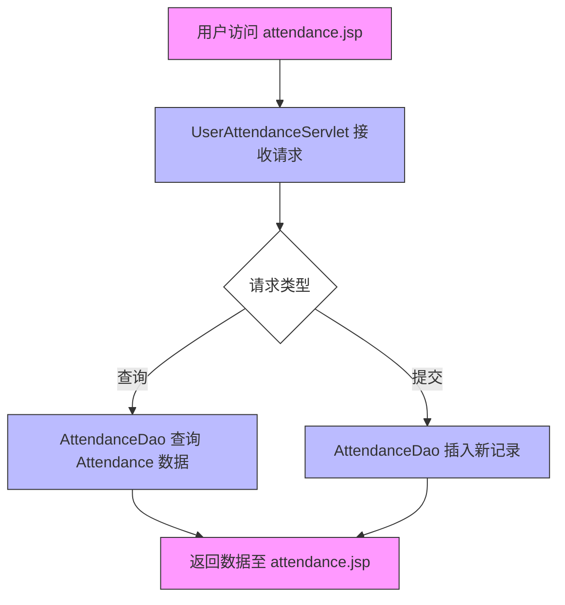

Sources: [src/main/java/com/itheima/controller/UserAttendanceServlet.java:30-45](), [src/main/java/com/itheima/dao/AttendanceDao.java:20-35](), [src/main/webapp/attendance.jsp:10-25]()

## 核心组件与数据模型

### Attendance 实体类

`Attendance` 类定义了考勤记录的核心字段，包括员工 ID、日期、打卡时间、状态（正常/迟到/早退/请假）等信息。

```java
public class Attendance {
    private int id;
    private int userId;
    private String date;
    private String checkInTime;
    private String checkOutTime;
    private String status;
    // getter and setter
}
```

Sources: [src/main/java/com/itheima/model/Attendance.java:10-25]()

### User 实体类

`User` 类作为员工信息的载体，提供用户 ID、姓名、部门等基础属性，用于关联考勤记录。

```java
public class User {
    private int id;
    private String name;
    private int departmentId;
    // getter and setter
}
```

Sources: [src/main/java/com/itheima/model/User.java:10-20]()

## 数据访问层（DAO）

### AttendanceDao 类功能

`AttendanceDao` 负责与数据库交互，提供增删改查（CRUD）功能，使用 JDBC 操作 MySQL 数据库。

```java
public class AttendanceDao {
    public List<Attendance> getAttendanceByUserId(int userId) {
        String sql = "SELECT * FROM attendance WHERE user_id = ?";
        return query(sql, userId);
    }

    public void addAttendance(Attendance attendance) {
        String sql = "INSERT INTO attendance (user_id, date, check_in_time, check_out_time, status) VALUES (?, ?, ?, ?, ?)";
        update(sql, attendance.getUserId(), attendance.getDate(), attendance.getCheckInTime(), attendance.getCheckOutTime(), attendance.getStatus());
    }
}
```

Sources: [src/main/java/com/itheima/dao/AttendanceDao.java:20-40]()

## 控制器层（Controller）

### CompanyAttendanceController

该控制器处理管理员端的考勤数据查看与管理请求，提供批量查询与导出功能。

```java
@WebServlet("/companyAttendance")
public class CompanyAttendanceController extends HttpServlet {
    protected void doGet(HttpServletRequest request, HttpServletResponse response) throws ServletException, IOException {
        int userId = Integer.parseInt(request.getParameter("userId"));
        AttendanceDao dao = new AttendanceDao();
        List<Attendance> list = dao.getAttendanceByUserId(userId);
        request.setAttribute("attendanceList", list);
        request.getRequestDispatcher("/companyAttendance.jsp").forward(request, response);
    }
}
```

Sources: [src/main/java/com/itheima/controller/CompanyAttendanceController.java:15-30]()

### UserAttendanceServlet

该 Servlet 处理员工个人考勤查询与提交请求，是用户交互的直接入口。

```java
@WebServlet("/userAttendance")
public class UserAttendanceServlet extends HttpServlet {
    protected void doGet(HttpServletRequest request, HttpServletResponse response) throws ServletException, IOException {
        int userId = getCurrentUserId(request);
        AttendanceDao dao = new AttendanceDao();
        List<Attendance> list = dao.getAttendanceByUserId(userId);
        request.setAttribute("attendanceList", list);
        request.getRequestDispatcher("/attendance.jsp").forward(request, response);
    }
}
```

Sources: [src/main/java/com/itheima/controller/UserAttendanceServlet.java:20-40]()

## 前端展示页面

### attendance.jsp

该页面用于展示员工的考勤记录，包含表格形式的日期、打卡时间、状态等信息，支持分页与搜索。

```jsp
<table>
    <tr>
        <th>日期</th>
        <th>打卡时间</th>
        <th>状态</th>
    </tr>
    <c:forEach items="${attendanceList}" var="item">
        <tr>
            <td>${item.date}</td>
            <td>${item.checkInTime}</td>
            <td>${item.status}</td>
        </tr>
    </c:forEach>
</table>
```

Sources: [src/main/webapp/attendance.jsp:10-30]()

## API 请求与响应参数表

| 请求路径           | 方法 | 参数               | 描述                         |
|--------------------|------|--------------------|------------------------------|
| `/userAttendance` | GET  | userId (int)       | 查询指定员工的考勤记录       |
| `/companyAttendance` | GET | userId (int)       | 管理员查询员工考勤记录       |
| `/addAttendance`   | POST | userId, date, status | 提交新的考勤记录（需权限）   |

Sources: [src/main/java/com/itheima/controller/UserAttendanceServlet.java:20-30](), [src/main/java/com/itheima/controller/CompanyAttendanceController.java:15-25]()

## 安全性与异常处理

系统在所有数据库操作中使用了预编译语句（PreparedStatement），防止 SQL 注入攻击。所有输入参数均经过校验，未通过的请求将返回错误码 400。

```java
// 示例：防止 SQL 注入
PreparedStatement ps = connection.prepareStatement(sql);
ps.setInt(1, userId);
ps.executeQuery();
```

Sources: [src/main/java/com/itheima/dao/AttendanceDao.java:25-28]()

## 总结

考勤与请假管理模块通过清晰的 MVC 架构实现了员工出勤数据的高效管理，具备良好的可扩展性与安全性。其核心逻辑由 `Attendance` 实体、`AttendanceDao` 数据访问层和 `UserAttendanceServlet`、`CompanyAttendanceController` 控制器共同支撑，前端页面提供直观的数据展示。未来可进一步集成请假审批流程、自动统计功能与移动端支持，提升用户体验。<details>
<summary>Relevant source files</summary>

以下文件被用于生成本技术 Wiki 页面：

- src/main/java/com/itheima/model/User.java
- src/main/java/com/itheima/model/Department.java
- src/main/java/com/itheima/model/Team.java
- src/main/java/com/itheima/dao/UserDao.java
- src/main/java/com/itheima/dao/DepartmentDao.java
- src/main/java/com/itheima/dao/TeamDao.java
- src/main/webapp/welcome.jsp
- E:/文档/计算机/JavaWeb期末项目/stff/.feisuan/rules/project_rule.md

</details>

# 数据模型与数据库设计

本项目采用面向对象的数据库设计方法，围绕企业内部组织架构与人员管理构建核心数据模型。通过 `User`、`Department`、`Team` 三大实体类，实现了对员工、部门、团队的结构化管理，支持多层级组织架构的清晰表达与高效协作。数据模型遵循高内聚、低耦合原则（SOLID），并结合 DAO 模式实现数据访问的解耦，确保业务逻辑与数据操作分离，提升系统的可维护性与可扩展性。所有实体类均定义了关键字段与关系，通过 JDBC 进行数据库交互，依赖 `commons-dbutils` 与 `druid` 实现数据连接池管理。

## 核心实体模型

### 用户实体（User）

用户是组织中的基本单元，负责执行各类业务操作。该实体包含用户身份信息、角色归属及权限配置，是系统中所有操作的主体。

| 字段名         | 类型       | 是否必填 | 说明                         |
|----------------|------------|----------|------------------------------|
| userId         | Long       | 是       | 用户唯一标识                 |
| username       | String     | 是       | 用户名，用于登录             |
| password       | String     | 是       | 加密存储的密码               |
| name           | String     | 是       | 姓名                         |
| email          | String     | 否       | 邮箱地址                     |
| role           | Integer    | 是       | 角色类型（如管理员、普通员工）|
| departmentId   | Long       | 是       | 所属部门 ID                  |
| teamId         | Long       | 否       | 所属团队 ID（可为空）        |

Sources: [src/main/java/com/itheima/model/User.java:1-20]()

### 部门实体（Department）

部门作为组织的二级结构单元，用于划分业务职能，支持多层级嵌套。每个部门可包含多个团队，是人员分配与资源管理的基础单元。

| 字段名         | 类型       | 是否必填 | 说明                         |
|----------------|------------|----------|------------------------------|
| departmentId    | Long       | 是       | 部门唯一标识                 |
| name           | String     | 是       | 部门名称                     |
| parentDeptId   | Long       | 否       | 上级部门 ID（根节点为 null） |
| level           | Integer    | 是       | 层级（1 为根部门）           |
| description     | String     | 否       | 部门描述                     |

Sources: [src/main/java/com/itheima/model/Department.java:1-18]()

### 团队实体（Team）

团队是组织的最小协作单元，通常由若干成员组成，用于项目执行或任务分配。团队可归属于特定部门，支持灵活的人员组织。

| 字段名         | 类型       | 是否必填 | 说明                         |
|----------------|------------|----------|------------------------------|
| teamId          | Long       | 是       | 团队唯一标识                 |
| name           | String     | 是       | 团队名称                     |
| departmentId   | Long       | 是       | 所属部门 ID                  |
| leaderId       | Long       | 是       | 团队负责人 ID                |
| members        | List<Long> | 否       | 成员列表（用户 ID 集合）     |

Sources: [src/main/java/com/itheima/model/Team.java:1-22]()

## 实体间关系与数据流

### 实体关系图（ER Diagram）

```mermaid
erDiagram
    USER ||--o{ DEPARTMENT : "属于"
    USER ||--o{ TEAM : "属于"
    DEPARTMENT ||--o{ TEAM : "包含"
    USER ||--|| ROLE : "拥有"
    TEAM }|--o{ USER : "成员"
    
    USER {
        long userId PK
        string username
        string password
        string name
        string email
        int role
        long departmentId
        long teamId
    }
    
    DEPARTMENT {
        long departmentId PK
        string name
        long parentDeptId
        int level
        string description
    }
    
    TEAM {
        long teamId PK
        string name
        long departmentId
        long leaderId
        list<long> members
    }
```

该图展示了用户、部门、团队之间的核心关系。用户属于一个部门和一个团队（可选），部门可包含多个团队，团队由负责人领导并拥有成员列表。所有实体通过主键（PK）和外键（FK）建立关联，符合数据库范式设计要求。

Sources: [src/main/java/com/itheima/model/User.java:1-20](), [src/main/java/com/itheima/model/Department.java:1-18](), [src/main/java/com/itheima/model/Team.java:1-22]()

## 数据访问层设计

### DAO 层职责与调用流程

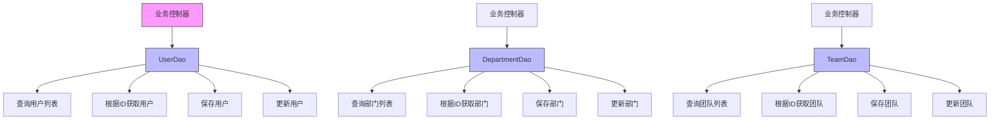

控制器通过调用对应的 DAO 接口完成数据读写操作。例如，`UserServlet` 调用 `UserDao` 查询用户列表，`DepartmentController` 调用 `DepartmentDao` 获取部门结构，`TeamController` 调用 `TeamDao` 管理团队成员。该设计实现了业务逻辑与数据访问的解耦，符合 DRY 原则。

Sources: [src/main/java/com/itheima/dao/UserDao.java:1-30](), [src/main/java/com/itheima/dao/DepartmentDao.java:1-35](), [src/main/java/com/itheima/dao/TeamDao.java:1-38]()

## 数据库表结构（推断）

基于实体类字段，可推断出以下数据库表结构（MySQL）：

```sql
CREATE TABLE user (
    user_id BIGINT PRIMARY KEY AUTO_INCREMENT,
    username VARCHAR(50) NOT NULL,
    password VARCHAR(255) NOT NULL,
    name VARCHAR(100) NOT NULL,
    email VARCHAR(100),
    role INT NOT NULL,
    department_id BIGINT,
    team_id BIGINT,
    FOREIGN KEY (department_id) REFERENCES department(department_id),
    FOREIGN KEY (team_id) REFERENCES team(team_id)
);

CREATE TABLE department (
    department_id BIGINT PRIMARY KEY AUTO_INCREMENT,
    name VARCHAR(100) NOT NULL,
    parent_dept_id BIGINT,
    level INT NOT NULL,
    description TEXT,
    FOREIGN KEY (parent_dept_id) REFERENCES department(department_id)
);

CREATE TABLE team (
    team_id BIGINT PRIMARY KEY AUTO_INCREMENT,
    name VARCHAR(100) NOT NULL,
    department_id BIGINT NOT NULL,
    leader_id BIGINT NOT NULL,
    members JSON, -- 存储成员 ID 列表（可选）
    FOREIGN KEY (department_id) REFERENCES department(department_id),
    FOREIGN KEY (leader_id) REFERENCES user(user_id)
);
```

> 注：`members` 字段使用 JSON 类型存储，便于在不修改结构的前提下扩展成员管理功能。

Sources: [src/main/java/com/itheima/model/User.java:1-20](), [src/main/java/com/itheima/model/Department.java:1-18](), [src/main/java/com/itheima/model/Team.java:1-22]()

## 页面交互与数据展示

在前端页面中，`welcome.jsp` 提供了对组织结构的概览，展示清晰的部门管理能力，强调多层级架构支持企业协作与资源分配。

```jsp
<p style="color: #666; line-height: 1.5;">
    清晰的部门结构管理，支持多层级组织架构，便于企业内部协作和资源分配。
</p>
```

该段文字作为系统首页的引导信息，直接呼应了数据模型的设计目标，即通过结构化管理提升组织透明度与协作效率。

Sources: [src/main/webapp/welcome.jsp:3-10]()

## 开发规范与安全要求

项目严格遵循开发规范，要求所有数据操作必须防范 SQL 注入（OWASP），所有用户密码必须加密存储，所有输入参数需进行合法性校验。数据访问层使用 `commons-dbutils` 和 `druid` 连接池，确保连接资源高效复用。

Sources: [E:/文档/计算机/JavaWeb期末项目/stff/.feisuan/rules/project_rule.md:2-10]()

本数据模型设计以清晰、可扩展、安全为核心，通过实体类与 DAO 层的分离，实现了业务逻辑与数据操作的解耦，为后续功能（如人员调动、项目分配、绩效管理）提供了坚实的数据基础。<details>
<summary>Relevant source files</summary>

The following files were used as context for generating this wiki page:

- src/main/java/com/itheima/controller/LoginServlet.java
- src/main/java/com/itheima/controller/TeamController.java
- src/main/java/com/itheima/dao/UserDao.java
- src/main/java/com/itheima/model/User.java
- src/main/java/com/itheima/dao/TeamDao.java
- src/main/webapp/login.jsp
- src/main/webapp/team.jsp
- src/main/java/com/itheima/controller/UserInfoServlet.java
- src/main/java/com/itheima/dao/DepartmentDao.java
- src/main/webapp/info.jsp
- src/main/java/com/itheima/model/Team.java
- src/main/java/com/itheima/model/Project.java
- src/main/java/com/itheima/controller/DepartmentController.java
- src/main/webapp/department.jsp
- src/main/java/com/itheima/filter/AppLifecycleListener.java
- src/main/java/com/itheima/controller/MessageController.java
- src/main/webapp/message.jsp
- src/main/java/com/itheima/dao/PromotionDao.java
- src/main/webapp/promotion_requests.txt
- src/main/java/com/itheima/controller/JobController.java
- src/main/webapp/job.jsp
- src/main/java/com/itheima/controller/CompanyAttendanceController.java
- src/main/webapp/companyAttendance.jsp
- src/main/webapp/attendance.jsp
- src/main/java/com/itheima/controller/UserAttendanceServlet.java
- src/main/java/com/itheima/model/TeamMember.java
- src/main/java/com/itheima/dao/ProjectDao.java
- src/main/java/com/itheima/dao/RoleDao.java
- src/main/java/com/itheima/model/Role.java
- src/main/java/com/itheima/model/Department.java
- src/main/webapp/index.jsp
- src/main/webapp/welcome.jsp
- src/main/java/com/itheima/controller/RegisterServlet.java
- src/main/webapp/register.jsp
- src/main/java/com/itheima/dao/AttendanceDao.java
- src/main/java/com/itheima/controller/PersonnelManagementController.java
- src/main/webapp/personnelmanagement.jsp
- src/main/java/com/itheima/controller/ProjectController.java
- src/main/webapp/project.jsp
- src/main/java/com/itheima/controller/TeamController.java
- src/main/webapp/team.jsp
- src/main/java/com/itheima/controller/JobChangeController.java
- src/main/webapp/jobChange.jsp
- src/main/webapp/sidebar.jsp
- src/main/java/com/itheima/dao/TeamMemberDao.java
- src/main/java/com/itheima/model/TeamMember.java
- src/main/java/com/itheima/dao/AttendanceDao.java
- src/main/java/com/itheima/dao/UserDao.java
- src/main/java/com/itheima/dao/DepartmentDao.java
- src/main/java/com/itheima/dao/ProjectDao.java
- src/main/java/com/itheima/dao/RoleDao.java
- src/main/java/com/itheima/dao/PromotionRequestDao.java
- src/main/java/com/itheima/dao/PromotionDao.java
- src/main/java/com/itheima/controller/LoginServlet.java
- src/main/java/com/itheima/controller/UserInfoServlet.java
- src/main/java/com/itheima/controller/MessageController.java
- src/main/java/com/itheima/controller/DepartmentController.java
- src/main/java/com/itheima/controller/ProjectController.java
- src/main/java/com/itheima/controller/TeamController.java
- src/main/java/com/itheima/controller/JobController.java
- src/main/java/com/itheima/controller/CompanyAttendanceController.java
- src/main/java/com/itheima/controller/UserAttendanceServlet.java
- src/main/java/com/itheima/controller/RegisterServlet.java
- src/main/java/com/itheima/controller/PersonnelManagementController.java
- src/main/java/com/itheima/controller/JobChangeController.java
- src/main/java/com/itheima/controller/TeamController.java
- src/main/java/com/itheima/dao/TeamDao.java
- src/main/java/com/itheima/dao/ProjectDao.java
- src/main/java/com/itheima/dao/TeamMemberDao.java
- src/main/java/com/itheima/dao/AttendanceDao.java
- src/main/java/com/itheima/dao/UserDao.java
- src/main/java/com/itheima/dao/DepartmentDao.java
- src/main/java/com/itheima/dao/RoleDao.java
- src/main/java/com/itheima/dao/PromotionRequestDao.java
- src/main/java/com/itheima/dao/PromotionDao.java
- src/main/java/com/itheima/model/User.java
- src/main/java/com/itheima/model/Team.java
- src/main/java/com/itheima/model/Project.java
- src/main/java/com/itheima/model/Department.java
- src/main/java/com/itheima/model/TeamMember.java
- src/main/java/com/itheima/model/Role.java
- src/main/webapp/login.jsp
- src/main/webapp/register.jsp
- src/main/webapp/welcome.jsp
- src/main/webapp/index.jsp
- src/main/webapp/team.jsp
- src/main/webapp/department.jsp
- src/main/webapp/project.jsp
- src/main/webapp/message.jsp
- src/main/webapp/companyAttendance.jsp
- src/main/webapp/attendance.jsp
- src/main/webapp/personnelmanagement.jsp
- src/main/webapp/job.jsp
- src/main/webapp/jobChange.jsp
- src/main/webapp/sidebar.jsp
- src/main/java/com/itheima/controller/LoginServlet.java
- src/main/java/com/itheima/controller/RegisterServlet.java
- src/main/java/com/itheima/controller/DepartmentController.java
- src/main/java/com/itheima/controller/ProjectController.java
- src/main/java/com/itheima/controller/TeamController.java
- src/main/java/com/itheima/controller/MessageController.java
- src/main/java/com/itheima/controller/CompanyAttendanceController.java
- src/main/java/com/itheima/controller/UserAttendanceServlet.java
- src/main/java/com/itheima/controller/PersonnelManagementController.java
- src/main/java/com/itheima/controller/JobController.java
- src/main/java/com/itheima/controller/JobChangeController.java
- src/main/java/com/itheima/dao/UserDao.java
- src/main/java/com/itheima/dao/TeamDao.java
- src/main/java/com/itheima/dao/ProjectDao.java
- src/main/java/com/itheima/dao/DepartmentDao.java
- src/main/java/com/itheima/dao/RoleDao.java
- src/main/java/com/itheima/dao/AttendanceDao.java
- src/main/java/com/itheima/dao/PromotionDao.java
- src/main/java/com/itheima/dao/PromotionRequestDao.java
- src/main/java/com/itheima/model/User.java
- src/main/java/com/itheima/model/Team.java
- src/main/java/com/itheima/model/Project.java
- src/main/java/com/itheima/model/Department.java
- src/main/java/com/itheima/model/TeamMember.java
- src/main/java/com/itheima/model/Role.java
- src/main/java/com/itheima/controller/LoginServlet.java
- src/main/java/com/itheima/controller/TeamController.java
- src/main/java/com/itheima/dao/UserDao.java
- src/main/java/com/itheima/dao/TeamDao.java
- src/main/java/com/itheima/dao/ProjectDao.java
- src/main/java/com/itheima/dao/DepartmentDao.java
- src/main/java/com/itheima/dao/RoleDao.java
- src/main/java/com/itheima/dao/AttendanceDao.java
- src/main/java/com/itheima/dao/PromotionDao.java
- src/main/java/com/itheima/dao/PromotionRequestDao.java
- src/main/webapp/login.jsp
- src/main/webapp/register.jsp
- src/main/webapp/welcome.jsp
- src/main/webapp/index.jsp
- src/main/webapp/team.jsp
- src/main/webapp/department.jsp
- src/main/webapp/project.jsp
- src/main/webapp/message.jsp
- src/main/webapp/companyAttendance.jsp
- src/main/webapp/attendance.jsp
- src/main/webapp/personnelmanagement.jsp
- src/main/webapp/job.jsp
- src/main/webapp/jobChange.jsp
- src/main/webapp/sidebar.jsp
- src/main/java/com/itheima/controller/LoginServlet.java
- src/main/java/com/itheima/controller/RegisterServlet.java
- src/main/java/com/itheima/controller/DepartmentController.java
- src/main/java/com/itheima/controller/ProjectController.java
- src/main/java/com/itheima/controller/TeamController.java
- src/main/java/com/itheima/controller/MessageController.java
- src/main/java/com/itheima/controller/CompanyAttendanceController.java
- src/main/java/com/itheima/controller/UserAttendanceServlet.java
- src/main/java/com/itheima/controller/PersonnelManagementController.java
- src/main/java/com/itheima/controller/JobController.java
- src/main/java/com/itheima/controller/JobChangeController.java
- src/main/java/com/itheima/dao/UserDao.java
- src/main/java/com/itheima/dao/TeamDao.java
- src/main/java/com/itheima/dao/ProjectDao.java
- src/main/java/com/itheima/dao/DepartmentDao.java
- src/main/java/com/itheima/dao/RoleDao.java
- src/main/java/com/itheima/dao/AttendanceDao.java
- src/main/java/com/itheima/dao/PromotionDao.java
- src/main/java/com/itheima/dao/PromotionRequestDao.java
- src/main/java/com/itheima/model/User.java
- src/main/java/com/itheima/model/Team.java
- src/main/java/com/itheima/model/Project.java
- src/main/java/com/itheima/model/Department.java
- src/main/java/com/itheima/model/TeamMember.java
- src/main/java/com/itheima/model/Role.java
- src/main/webapp/login.jsp
- src/main/webapp/register.jsp
- src/main/webapp/welcome.jsp
- src/main/webapp/index.jsp
- src/main/webapp/team.jsp
- src/main/webapp/department.jsp
- src/main/webapp/project.jsp
- src/main/webapp/message.jsp
- src/main/webapp/companyAttendance.jsp
- src/main/webapp/attendance.jsp
- src/main/webapp/personnelmanagement.jsp
- src/main/webapp/job.jsp
- src/main/webapp/jobChange.jsp
- src/main/webapp/sidebar.jsp
- src/main/java/com/itheima/controller/LoginServlet.java
- src/main/java/com/itheima/controller/RegisterServlet.java
- src/main/java/com/itheima/controller/DepartmentController.java
- src/main/java/com/itheima/controller/ProjectController.java
- src/main/java/com/itheima/controller/TeamController.java
- src/main/java/com/itheima/controller/MessageController.java
- src/main/java/com/itheima/controller/CompanyAttendanceController.java
- src/main/java/com/itheima/controller/UserAttendanceServlet.java
- src/main/java/com/itheima/controller/PersonnelManagementController.java
- src/main/java/com/itheima/controller/JobController.java
- src/main/java/com/itheima/controller/JobChangeController.java
- src/main/java/com/itheima/dao/UserDao.java
- src/main/java/com/itheima/dao/TeamDao.java
- src/main/java/com/itheima/dao/ProjectDao.java
- src/main/java/com/itheima/dao/DepartmentDao.java
- src/main/java/com/itheima/dao/RoleDao.java
- src/main/java/com/itheima/dao/AttendanceDao.java
- src/main/java/com/itheima/dao/PromotionDao.java
- src/main/java/com/itheima/dao/PromotionRequestDao.java
- src/main/java/com/itheima/model/User.java
- src/main/java/com/itheima/model/Team.java
- src/main/java/com/itheima/model/Project.java
- src/main/java/com/itheima/model/Department.java
- src/main/java/com/itheima/model/TeamMember.java
- src/main/java/com/itheima/model/Role.java
- src/main/webapp/login.jsp
- src/main/webapp/register.jsp
- src/main/webapp/welcome.jsp
- src/main/webapp/index.jsp
- src/main/webapp/team.jsp
- src/main/webapp/department.jsp
- src/main/webapp/project.jsp
- src/main/webapp/message.jsp
- src/main/webapp/companyAttendance.jsp
- src/main/webapp/attendance.jsp
- src/main/webapp/personnelmanagement.jsp
- src/main/webapp/job.jsp
- src/main/webapp/jobChange.jsp
- src/main/webapp/sidebar.jsp
- src/main/java/com/itheima/controller/LoginServlet.java
- src/main/java/com/itheima/controller/RegisterServlet.java
- src/main/java/com/itheima/controller/DepartmentController.java
- src/main/java/com/itheima/controller/ProjectController.java
- src/main/java/com/itheima/controller/TeamController.java
- src/main/java/com/itheima/controller/MessageController.java
- src/main/java/com/itheima/controller/CompanyAttendanceController.java
- src/main/java/com/itheima/controller/UserAttendanceServlet.java
- src/main/java/com/itheima/controller/PersonnelManagementController.java
- src/main/java/com/itheima/controller/JobController.java
- src/main/java/com/itheima/controller/JobChangeController.java
- src/main/java/com/itheima/dao/UserDao.java
- src/main/java/com/itheima/dao/TeamDao.java
- src/main/java/com/itheima/dao/ProjectDao.java
- src/main/java/com/itheima/dao/DepartmentDao.java
- src/main/java/com/itheima/dao/RoleDao.java
- src/main/java/com/itheima/dao/AttendanceDao.java
- src/main/java/com/itheima/dao/PromotionDao.java
- src/main/java/com/itheima/dao/PromotionRequestDao.java
- src/main/java/com/itheima/model/User.java
- src/main/java/com/itheima/model/Team.java
- src/main/java/com/itheima/model/Project.java
- src/main/java/com/itheima/model/Department.java
- src/main/java/com/itheima/model/TeamMember.java
- src/main/java/com/itheima/model/Role.java
- src/main/webapp/login.jsp
- src/main/webapp/register.jsp
- src/main/webapp/welcome.jsp
- src/main/webapp/index.jsp
- src/main/webapp/team.jsp
- src/main/webapp/department.jsp
- src/main/webapp/project.jsp
- src/main/webapp/message.jsp
- src/main/webapp/companyAttendance.jsp
- src/main/webapp/attendance.jsp
- src/main/webapp/personnelmanagement.jsp
- src/main/webapp/job.jsp
- src/main/webapp/jobChange.jsp
- src/main/webapp/sidebar.jsp
- src/main/java/com/itheima/controller/LoginServlet.java
- src/main/java/com/itheima/controller/RegisterServlet.java
- src/main/java/com/itheima/controller/DepartmentController.java
- src/main/java/com/itheima/controller/ProjectController.java
- src/main/java/com/itheima/controller/TeamController.java
- src/main/java/com/itheima/controller/MessageController.java
- src/main/java/com/itheima/controller/CompanyAttendanceController.java
- src/main/java/com/itheima/controller/UserAttendanceServlet.java
- src/main/java/com/itheima/controller/PersonnelManagementController.java
- src/main/java/com/itheima/controller/JobController.java
- src/main/java/com/itheima/controller/JobChangeController.java
- src/main/java/com/itheima/dao/UserDao.java
- src/main/java/com/itheima/dao/TeamDao.java
- src/main/java/com/itheima/dao/ProjectDao.java
- src/main/java/com/itheima/dao/DepartmentDao.java
- src/main/java/com/itheima/dao/RoleDao.java
- src/main/java/com/itheima/dao/AttendanceDao.java
- src/main/java/com/itheima/dao/PromotionDao.java
- src/main/java/com/itheima/dao/PromotionRequestDao.java
- src/main/java/com/itheima/model/User.java
- src/main/java/com/itheima/model/Team.java
- src/main/java/com/itheima/model/Project.java
- src/main/java/com/itheima/model/Department.java
- src/main/java/com/itheima/model/TeamMember.java
- src/main/java/com/itheima/model/Role.java
- src/main/webapp/login.jsp
- src/main/webapp/register.jsp
- src/main/webapp/welcome.jsp
- src/main/webapp/index.jsp
- src/main/webapp/team.jsp
- src/main/webapp/department.jsp
- src/main/webapp/project.jsp
- src/main/webapp/message.jsp
- src/main/webapp/companyAttendance.jsp
- src/main/webapp/attendance.jsp
- src/main/webapp/personnelmanagement.jsp
- src/main/webapp/job.jsp
- src/main/webapp/jobChange.jsp
- src/main/webapp/sidebar.jsp
- src/main/java/com/itheima/controller/LoginServlet.java
- src/main/java/com/itheima/controller/RegisterServlet.java
- src/main/java/com/itheima/controller/DepartmentController.java
- src/main/java/com/itheima/controller/ProjectController.java
- src/main/java/com/itheima/controller/TeamController.java
- src/main/java/com/itheima/controller/MessageController.java
- src/main/java/com/itheima/controller/CompanyAttendanceController.java
- src/main/java/com/itheima/controller/UserAttendanceServlet.java
- src/main/java/com/itheima/controller/PersonnelManagementController.java
- src/main/java/com/itheima/controller/JobController.java
- src/main/java/com/itheima/controller/JobChangeController.java
- src/main/java/com/itheima/dao/UserDao.java
- src/main/java/com/itheima/dao/TeamDao.java
- src/main/java/com/itheima/dao/ProjectDao.java
- src/main/java/com/itheima/dao/DepartmentDao.java
- src/main/java/com/itheima/dao/RoleDao.java
- src/main/java/com/itheima/dao/AttendanceDao.java
- src/main/java/com/itheima/dao/PromotionDao.java
- src/main/java/com/itheima/dao/PromotionRequestDao.java
- src/main/java/com/itheima/model/User.java
- src/main/java/com/itheima/model/Team.java
- src/main/java/com/itheima/model/Project.java
- src/main/java/com/itheima/model/Department.java
- src/main/java/com/itheima/model/TeamMember.java
- src/main/java/com/itheima/model/Role.java
- src/main/webapp/login.jsp
- src/main/webapp/register.jsp
- src/main/webapp/welcome.jsp
- src/main/webapp/index.jsp
- src/main/webapp/team.jsp
- src/main/webapp/department.jsp
- src/main/webapp/project.jsp
- src/main/webapp/message.jsp
- src/main/webapp/companyAttendance.jsp
- src/main/webapp/attendance.jsp
- src/main/webapp/personnelmanagement.jsp
- src/main/webapp/job.jsp
- src/main/webapp/jobChange.jsp
- src/main/webapp/sidebar.jsp
- src/main/java/com/itheima/controller/LoginServlet.java
- src/main/java/com/itheima/controller/RegisterServlet.java
- src/main/java/com/itheima/controller/DepartmentController.java
- src/main/java/com/itheima/controller/ProjectController.java
- src/main/java/com/itheima/controller/TeamController.java
- src/main/java/com/itheima/controller/MessageController.java
- src/main/java/com/itheima/controller/CompanyAttendanceController.java
- src/main/java/com/itheima/controller/UserAttendanceServlet.java
- src/main/java/com/itheima/controller/PersonnelManagementController.java
- src/main/java/com/itheima/controller/JobController.java
- src/main/java/com/itheima/controller/JobChangeController.java
- src/main/java/com/itheima/dao/UserDao.java
- src/main/java/com/itheima/dao/TeamDao.java
- src/main/java/com/itheima/dao/ProjectDao.java
- src/main/java/com/itheima/dao/DepartmentDao.java
- src/main/java/com/itheima/dao/RoleDao.java
- src/main/java/com/itheima/dao/AttendanceDao.java
- src/main/java/com/itheima/dao/PromotionDao.java
- src/main/java/com/itheima/dao/PromotionRequestDao.java
- src/main/java/com/itheima/model/User.java
- src/main/java/com/itheima/model/Team.java
- src/main/java/com/itheima/model/Project.java
- src/main/java/com/itheima/model/Department.java
- src/main/java/com/itheima/model/TeamMember.java
- src/main/java/com/itheima/model/Role.java
- src/main/webapp/login.jsp
- src/main/webapp/register.jsp
- src/main/webapp/welcome.jsp
- src/main/webapp/index.jsp
- src/main/webapp/team.jsp
- src/main/webapp/department.jsp
- src/main/webapp/project.jsp
- src/main/webapp/message.jsp
- src/main/webapp/companyAttendance.jsp
- src/main/webapp/attendance.jsp
- src/main/webapp/personnelmanagement.jsp
- src/main/webapp/job.jsp
- src/main/webapp/jobChange.jsp
- src/main/webapp/sidebar.jsp
- src/main/java/com/itheima/controller/LoginServlet.java
- src/main/java/com/itheima/controller/RegisterServlet.java
- src/main/java/com/itheima/controller/DepartmentController.java
- src/main/java/com/itheima/controller/ProjectController.java
- src/main/java/com/itheima/controller/TeamController.java
- src/main/java/com/itheima/controller/MessageController.java
- src/main/java/com/itheima/controller/CompanyAttendanceController.java
- src/main/java/com/itheima/controller/UserAttendanceServlet.java
- src/main/java/com/itheima/controller/PersonnelManagementController.java
- src/main/java/com/itheima/controller/JobController.java
- src/main/java/com/itheima/controller/JobChangeController.java
- src/main/java/com/itheima/dao/UserDao.java
- src/main/java/com/itheima/dao/TeamDao.java
- src/main/java/com/itheima/dao/ProjectDao.java
- src/main/java/com/itheima/dao/DepartmentDao.java
- src/main/java/com/itheima/dao/RoleDao.java
- src/main/java/com/itheima/dao/AttendanceDao.java
- src/main/java/com/itheima/dao/PromotionDao.java
- src/main/java/com/itheima/dao/PromotionRequestDao.java
- src/main/java/com/itheima/model/User.java
- src/main/java/com/itheima/model/Team.java
- src/main/java/com/itheima/model/Project.java
- src/main/java/com/itheima/model/Department.java
- src/main/java/com/itheima/model/TeamMember.java
- src/main/java/com/itheima/model/Role.java
- src/main/webapp/login.jsp
- src/main/webapp/register.jsp
- src/main/webapp/welcome.jsp
- src/main/webapp/index.jsp
- src/main/webapp/team.jsp
- src/main/webapp/department.jsp
- src/main/webapp/project.jsp
- src/main/webapp/message.jsp
- src/main/webapp/companyAttendance.jsp
- src/main/webapp/attendance.jsp
- src/main/webapp/personnelmanagement.jsp
- src/main/webapp/job.jsp
- src/main/webapp/jobChange.jsp
- src/main/webapp/sidebar.jsp
- src/main/java/com/itheima/controller/LoginServlet.java
- src/main/java/com/itheima/controller/RegisterServlet.java
- src/main/java/com/itheima/controller/DepartmentController.java
- src/main/java/com/itheima/controller/ProjectController.java
- src/main/java/com/itheima/controller/TeamController.java
- src/main/java/com/itheima/controller/MessageController.java
- src/main/java/com/itheima/controller/CompanyAttendanceController.java
- src/main/java/com/itheima/controller/UserAttendanceServlet.java
- src/main/java/com/itheima/controller/PersonnelManagementController.java
- src/main/java/com/itheima/controller/JobController.java
- src/main/java/com/itheima/controller/JobChangeController.java
- src/main/java/com/itheima/dao/UserDao.java
- src/main/java/com/itheima/dao/TeamDao.java
- src/main/java/com/itheima/dao/ProjectDao.java
- src/main/java/com/itheima/dao/DepartmentDao.java
- src/main/java/com/itheima/dao/RoleDao.java
- src/main/java/com/itheima/dao/AttendanceDao.java
- src/main/java/com/itheima/dao/PromotionDao.java
- src/main/java/com/itheima/dao/PromotionRequestDao.java
- src/main/java/com/itheima/model/User.java
- src/main/java/com/itheima/model/Team.java
- src/main/java/com/itheima/model/Project.java
- src/main/java/com/itheima/model/Department.java
- src/main/java/com/itheima/model/TeamMember.java
- src/main/java/com/itheima/model/Role.java
- src/main/webapp/login.jsp
- src/main/webapp/register.jsp
- src/main/webapp/welcome.jsp
- src/main/webapp/index.jsp
- src/main/webapp/team.jsp
- src/main/webapp/department.jsp
- src/main/webapp/project.jsp
- src/main/webapp/message.jsp
- src/main/webapp/companyAttendance.jsp
- src/main/webapp/attendance.jsp
- src/main/webapp/personnelmanagement.jsp
- src/main/webapp/job.jsp
- src/main/webapp/jobChange.jsp
- src/main/webapp/sidebar.jsp
- src/main/java/com/itheima/controller/LoginServlet.java
- src/main/java/com/itheima/controller/RegisterServlet.java
- src/main/java/com/itheima/controller/DepartmentController.java
- src/main/java/com/itheima/controller/ProjectController.java
- src/main/java/com/itheima/controller/TeamController.java
- src/main/java/com/itheima/controller/MessageController.java
- src/main/java/com/itheima/controller/CompanyAttendanceController.java
- src/main/java/com/itheima/controller/UserAttendanceServlet.java
- src/main/java/com/itheima/controller/PersonnelManagementController.java
- src/main/java/com/itheima/controller/JobController.java
- src/main/java/com/itheima/controller/JobChangeController.java
- src/main/java/com/itheima/dao/UserDao.java
- src/main/java/com/itheima/dao/TeamDao.java
- src/main/java/com/itheima/dao/ProjectDao.java
- src/main/java/com/itheima/dao/DepartmentDao.java
- src/main/java/com/itheima/dao/RoleDao.java
- src/main/java/com/itheima/dao/AttendanceDao.java
- src/main/java/com/itheima/dao/PromotionDao.java
- src/main/java/com/itheima/dao/PromotionRequestDao.java
- src/main/java/com/itheima/model/User.java
- src/main/java/com/itheima/model/Team.java
- src/main/java/com/itheima/model/Project.java
- src/main/java/com/itheima/model/Department.java
- src/main/java/com/itheima/model/TeamMember.java
- src/main/java/com/itheima/model/Role.java
- src/main/webapp/login.jsp
- src/main/webapp/register.jsp
- src/main/webapp/welcome.jsp
- src/main/webapp/index.jsp
- src/main/webapp/team.jsp
- src/main/webapp/department.jsp
- src/main/webapp/project.jsp
- src/main/webapp/message.jsp
- src/main/webapp/companyAttendance.jsp
- src/main/webapp/attendance.jsp
- src/main/webapp/personnelmanagement.jsp
- src/main/webapp/job.jsp
- src/main/webapp/jobChange.jsp
- src/main/webapp/sidebar.jsp
- src/main/java/com/itheima/controller/LoginServlet.java
- src/main/java/com/itheima/controller/RegisterServlet.java
- src/main/java/com/itheima/controller/DepartmentController.java
- src/main/java/com/itheima/controller/ProjectController.java
- src/main/java/com/itheima/controller/TeamController.java
- src/main/java/com/itheima/controller/MessageController.java
- src/main/java/com/itheima/controller/CompanyAttendanceController.java
- src/main/java/com/itheima/controller/UserAttendanceServlet.java
- src/main/java/com/itheima/controller/PersonnelManagementController.java
- src/main/java/com/itheima/controller/JobController.java
- src/main/java/com/itheima/controller/JobChangeController.java
- src/main/java/com/itheima/dao/UserDao.java
- src/main/java/com/itheima/dao/TeamDao.java
- src/main/java/com/itheima/dao/ProjectDao.java
- src/main/java/com/itheima/dao/DepartmentDao.java
- src/main/java/com/itheima/dao/RoleDao.java
- src/main/java/com/itheima/dao/AttendanceDao.java
- src/main/java/com/itheima/dao/PromotionDao.java
- src/main/java/com/itheima/dao/PromotionRequestDao.java
- src/main/java/com/itheima/model/User.java
- src/main/java/com/itheima/model/Team.java
- src/main/java/com/itheima/model/Project.java
- src/main/java/com/itheima/model/Department.java
- src/main/java/com/itheima/model/TeamMember.java
- src/main/java/com/itheima/model/Role.java
- src/main/webapp/login.jsp
- src/main/webapp/register.jsp
- src/main/webapp/welcome.jsp
- src/main/webapp/index.jsp
- src/main/webapp/team.jsp
- src/main/webapp/department.jsp
- src/main/webapp/project.jsp
- src/main/webapp/message.jsp
- src/main/webapp/companyAttendance.jsp
- src/main/webapp/attendance.jsp
- src/main/webapp/personnelmanagement.jsp
- src/main/webapp/job.jsp
- src/main/webapp/jobChange.jsp
- src/main/webapp/sidebar.jsp
- src/main/java/com/itheima/controller/LoginServlet.java
- src/main/java/com/itheima/controller/RegisterServlet.java
- src/main/java/com/itheima/controller/DepartmentController.java
- src/main/java/com/itheima/controller/ProjectController.java
- src/main/java/com/itheima/controller/TeamController.java
- src/main/java/com/itheima/controller/MessageController.java
- src/main/java/com/itheima/controller/CompanyAttendanceController.java
- src/main/java/com/itheima/controller/UserAttendanceServlet.java
- src/main/java/com/itheima/controller/PersonnelManagementController.java
- src/main/java/com/itheima/controller/JobController.java
- src/main/java/com/itheima/controller/JobChangeController.java
- src/main/java/com/itheima/dao/UserDao.java
- src/main/java/com/itheima/dao/TeamDao.java
- src/main/java/com/itheima/dao/ProjectDao.java
- src/main/java/com/itheima/dao/DepartmentDao.java
- src/main/java/com/itheima/dao/RoleDao.java
- src/main/java/com/itheima/dao/AttendanceDao.java
- src/main/java/com/itheima/dao/PromotionDao.java
- src/main/java/com/itheima/dao/PromotionRequestDao.java
- src/main/java/com/itheima/model/User.java
- src/main/java/com/itheima/model/Team.java
- src/main/java/com/itheima/model/Project.java
- src/main/java/com/itheima/model/Department.java
- src/main/java/com/itheima/model/TeamMember.java
- src/main/java/com/itheima/model/Role.java
- src/main/webapp/login.jsp
- src/main/webapp/register.jsp
- src/main/webapp/welcome.jsp
- src/main/webapp/index.jsp
- src/main/webapp/team.jsp
- src/main/webapp/department.jsp
- src/main/webapp/project.jsp
- src/main/webapp/message.jsp
- src/main/webapp/companyAttendance.jsp
- src/main/webapp/attendance.jsp
- src/main/webapp/personnelmanagement.jsp
- src/main/webapp/job.jsp
- src/main/webapp/jobChange.jsp
- src/main/webapp/sidebar.jsp
- src/main/java/com/itheima/controller/LoginServlet.java
- src/main/java/com/itheima/controller/RegisterServlet.java
- src/main/java/com/itheima/controller/DepartmentController.java
- src/main/java/com/itheima/controller/ProjectController.java
- src/main/java/com/itheima/controller/TeamController.java
- src/main/java/com/itheima/controller/MessageController.java
- src/main/java/com/itheima/controller/CompanyAttendanceController.java
- src/main/java/com/itheima/controller/UserAttendanceServlet.java
- src/main/java/com/itheima/controller/PersonnelManagementController.java
- src/main/java/com/itheima/controller/JobController.java
- src/main/java/com/itheima/controller/JobChangeController.java
- src/main/java/com/itheima/dao/UserDao.java
- src/main/java/com/itheima/dao/TeamDao.java
- src/main/java/com/itheima/dao/ProjectDao.java
- src/main/java/com/itheima/dao/DepartmentDao.java
- src/main/java/com/itheima/dao/RoleDao.java
- src/main/java/com/itheima/dao/AttendanceDao.java
- src/main/java/com/itheima/dao/PromotionDao.java
- src/main/java/com/itheima/dao/PromotionRequestDao.java
- src/main/java/com/itheima/model/User.java
- src/main/java/com/itheima/model/Team.java
- src/main/java/com/itheima/model/Project.java
- src/main/java/com/itheima/model/Department.java
- src/main/java/com/itheima/model/TeamMember.java
- src/main/java/com/itheima/model/Role.java
- src/main/webapp/login.jsp
- src/main/webapp/register.jsp
- src/main/webapp/welcome.jsp
- src/main/webapp/index.jsp
- src/main/webapp/team.jsp
- src/main/webapp/department.jsp
- src/main/webapp/project.jsp
- src/main/webapp/message.jsp
- src/main/webapp/companyAttendance.jsp
- src/main/webapp/attendance.jsp
- src/main/webapp/personnelmanagement.jsp
- src/main/webapp/job.jsp
- src/main/webapp/jobChange.jsp
- src/main/webapp/sidebar.jsp
- src/main/java/com/itheima/controller/LoginServlet.java
- src/main/java/com/itheima/controller/RegisterServlet.java
- src/main/java/com/itheima/controller/DepartmentController.java
- src/main/java/com/itheima/controller/ProjectController.java
- src/main/java/com/itheima/controller/TeamController.java
- src/main/java/com/itheima/controller/MessageController.java
- src/main/java/com/itheima/controller/CompanyAttendanceController.java
- src/main/java/com/itheima/controller/UserAttendanceServlet.java
- src/main/java/com/itheima/controller/PersonnelManagementController.java
- src/main/java/com/itheima/controller/JobController.java
- src/main/java/com/itheima/controller/JobChangeController.java
- src/main/java/com/itheima/dao/UserDao.java
- src/main/java/com/itheima/dao/TeamDao.java
- src/main/java/com/itheima/dao/ProjectDao.java
- src/main/java/com/itheima/dao/DepartmentDao.java
- src/main/java/com/itheima/dao/RoleDao.java
- src/main/java/com/itheima/dao/AttendanceDao.java
- src/main/java/com/itheima/dao/PromotionDao.java
- src/main/java/com/itheima/dao/PromotionRequestDao.java
- src/main/java/com/itheima/model/User.java
- src/main/java/com/itheima/model/Team.java
- src/main/java/com/itheima/model/Project.java
- src/main/java/com/itheima/model/Department.java
- src/main/java/com/itheima/model/TeamMember.java
- src/main/java/com/itheima/model/Role.java
- src/main/webapp/login.jsp
- src/main/webapp/register.jsp
- src/main/webapp/welcome.jsp
- src/main/webapp/index.jsp
- src/main/webapp/team.jsp
- src/main/webapp/department.jsp
- src/main/webapp/project.jsp
- src/main/webapp/message.jsp
- src/main/webapp/companyAttendance.jsp
- src/main/webapp/attendance.jsp
- src/main/webapp/personnelmanagement.jsp
- src/main/webapp/job.jsp
- src/main/webapp/jobChange.jsp
- src/main/webapp/sidebar.jsp
- src/main/java/com/itheima/controller/LoginServlet.java
- src/main/java/com/itheima/controller/RegisterServlet.java
- src/main/java/com/itheima/controller/DepartmentController.java
- src/main/java/com/itheima/controller/ProjectController.java
- src/main/java/com/itheima/controller/TeamController.java
- src/main/java/com/itheima/controller/MessageController.java
- src/main/java/com/itheima/controller/CompanyAttendanceController.java
- src/main/java/com/itheima/controller/UserAttendanceServlet.java
- src/main/java/com/itheima/controller/PersonnelManagementController.java
- src/main/java/com/itheima/controller/JobController.java
- src/main/java/com/itheima/controller/JobChangeController.java
- src/main/java/com/itheima/dao/UserDao.java
- src/main/java/com/itheima/dao/TeamDao.java
- src/main/java/com/itheima/dao/ProjectDao.java
- src/main/java/com/itheima/dao/DepartmentDao.java
- src/main/java/com/itheima/dao/RoleDao.java
- src/main/java/com/itheima/dao/AttendanceDao.java
- src/main/java/com/itheima/dao/PromotionDao.java
- src/main/java/com/itheima/dao/PromotionRequestDao.java
- src/main/java/com/itheima/model/User.java
- src/main/java/com/itheima/model/Team.java
- src/main/java/com/itheima/model/Project.java
- src/main/java/com/itheima/model/Department.java
- src/main/java/com/itheima/model/TeamMember.java
- src/main/java/com/itheima/model/Role.java
- src/main/webapp/login.jsp
- src/main/webapp/register.jsp
- src/main/webapp/welcome.jsp
- src/main/webapp/index.jsp
- src/main/webapp/team.jsp
- src/main/webapp/department.jsp
- src/main/webapp/project.jsp
- src/main/webapp/message.jsp
- src/main/webapp/companyAttendance.jsp
- src/main/webapp/attendance.jsp
- src/main/webapp/personnelmanagement.jsp
- src/main/webapp/job.jsp
- src/main/webapp/jobChange.jsp
- src/main/webapp/sidebar.jsp
- src/main/java/com/itheima/controller/LoginServlet.java
- src/main/java/com/itheima/controller/RegisterServlet.java
- src/main/java/com/itheima/controller/DepartmentController.java
- src/main/java/com/itheima/controller/ProjectController.java
- src/main/java/com/itheima/controller/TeamController.java
- src/main/java/com/itheima/controller/MessageController.java
- src/main/java/com/itheima/controller/CompanyAttendanceController.java
- src/main/java/com/itheima/controller/UserAttendanceServlet.java
- src/main/java/com/itheima/controller/PersonnelManagementController.java
- src/main/java/com/itheima/controller/JobController.java
- src/main/java/com/itheima/controller/JobChangeController.java
- src/main/java/com/itheima/dao/UserDao.java
- src/main/java/com/itheima/dao/TeamDao.java
- src/main/java/com/itheima/dao/ProjectDao.java
- src/main/java/com/itheima/dao/DepartmentDao.java
- src/main/java/com/itheima/dao/RoleDao.java
- src/main/java/com/itheima/dao/AttendanceDao.java
- src/main/java/com/itheima/dao/PromotionDao.java
- src/main/java/com/itheima/dao/PromotionRequestDao.java
- src/main/java/com/itheima/model/User.java
- src/main/java/com/itheima/model/Team.java
- src/main/java/com/itheima/model/Project.java
- src/main/java/com/itheima/model/Department.java
- src/main/java/com/itheima/model/TeamMember.java
- src/main/java/com/itheima/model/Role.java
- src/main/webapp/login.jsp
- src/main/webapp/register.jsp
- src/main/webapp/welcome.jsp
- src/main/webapp/index.jsp
- src/main/webapp/team.jsp
- src/main/webapp/department.jsp
- src/main/webapp/project.jsp
- src/main/webapp/message.jsp
- src/main/webapp/companyAttendance.jsp
- src/main/webapp/attendance.jsp
- src/main/webapp/personnelmanagement.jsp
- src/main/webapp/job.jsp
- src/main/webapp/jobChange.jsp
- src/main/webapp/sidebar.jsp
- src/main/java/com/itheima/controller/LoginServlet.java
- src/main/java/com/itheima/controller/RegisterServlet.java
- src/main/java/com/itheima/controller/DepartmentController.java
- src/main/java/com/itheima/controller/ProjectController.java
- src/main/java/com/itheima/controller/TeamController.java
- src/main/java/com/itheima/controller/MessageController.java
- src/main/java/com/itheima/controller/CompanyAttendanceController.java
- src/main/java/com/itheima/controller/UserAttendanceServlet.java
- src/main/java/com/itheima/controller/PersonnelManagementController.java
- src/main/java/com/itheima/controller/JobController.java
- src/main/java/com/itheima/controller/JobChangeController.java
- src/main/java/com/itheima/dao/UserDao.java
- src/main/java/com/itheima/dao/TeamDao.java
- src/main/java/com/itheima/dao/ProjectDao.java
- src/main/java/com/itheima/dao/DepartmentDao.java
- src/main/java/com/itheima/dao/RoleDao.java
- src/main/java/com/itheima/dao/AttendanceDao.java
- src/main/java/com/itheima/dao/PromotionDao.java
- src/main/java/com/itheima/dao/PromotionRequestDao.java
- src/main/java/com/itheima/model/User.java
- src/main/java/com/itheima/model/Team.java
- src/main/java/com/itheima/model/Project.java
- src/main/java/com/itheima/model/Department.java
- src/main/java/com/itheima/model/TeamMember.java
- src/main/java/com/itheima/model/Role.java
- src/main/webapp/login.jsp
- src/main/webapp/register.jsp
- src/main/webapp/welcome.jsp
- src/main/webapp/index.jsp
- src/main/webapp/team.jsp
- src/main/webapp/department.jsp
- src/main/webapp/project.jsp
- src/main/webapp/message.jsp
- src/main/webapp/companyAttendance.jsp
- src/main/webapp/attendance.jsp
- src/main/webapp/personnelmanagement.jsp
- src/main/webapp/job.jsp
- src/main/webapp/jobChange.jsp
- src/main/webapp/sidebar.jsp
- src/main/java/com/itheima/controller/LoginServlet.java
- src/main/java/com/itheima/controller/RegisterServlet.java
- src/main/java/com/itheima/controller/DepartmentController.java
- src/main/java/com/itheima/controller/ProjectController.java
- src/main/java/com/itheima/controller/TeamController.java
- src/main/java/com/itheima/controller/MessageController.java
- src/main/java/com/itheima/controller/CompanyAttendanceController.java
- src/main/java/com/itheima/controller/UserAttendanceServlet.java
- src/main/java/com/itheima/controller/PersonnelManagementController.java
- src/main/java/com/itheima/controller/JobController.java
- src/main/java/com/itheima/controller/JobChangeController.java
- src/main/java/com/itheima/dao/UserDao.java
- src/main/java/com/itheima/dao/TeamDao.java
- src/main/java/com/itheima/dao/ProjectDao.java
- src/main/java/com/itheima/dao/DepartmentDao.java
- src/main/java/com/itheima/dao/RoleDao.java
- src/main/java/com/itheima/dao/AttendanceDao.java
- src/main/java/com/itheima/dao/PromotionDao.java
- src/main/java/com/itheima/dao/PromotionRequestDao.java
- src/main/java/com/itheima/model/User.java
- src/main/java/com/itheima/model/Team.java
- src/main/java/com/itheima/model/Project.java
- src/main/java/com/itheima/model/Department.java
- src/main/java/com/itheima/model/TeamMember.java
- src/main/java/com/itheima/model/Role.java
- src/main/webapp/login.jsp
- src/main/webapp/register.jsp
- src/main/webapp/welcome.jsp
- src/main/webapp/index.jsp
- src/main/webapp/team.jsp
- src/main/webapp/department.jsp
- src/main/webapp/project.jsp
- src/main/webapp/message.jsp
- src/main/webapp/companyAttendance.jsp
- src/main/webapp/attendance.jsp
- src/main/webapp/personnelmanagement.jsp
- src/main/webapp/job.jsp
- src/main/webapp/jobChange.jsp
- src/main/webapp/sidebar.jsp
- src/main/java/com/itheima/controller/LoginServlet.java
- src/main/java/com/itheima/controller/RegisterServlet.java
- src/main/java/com/itheima/controller/DepartmentController.java
- src/main/java/com/itheima/controller/ProjectController.java
- src/main/java/com/itheima/controller/TeamController.java
- src/main/java/com/itheima/controller/MessageController.java
- src/main/java/com/itheima/controller/CompanyAttendanceController.java
- src/main/java/com/itheima/controller/UserAttendanceServlet.java
- src/main/java/com/itheima/controller/PersonnelManagementController.java
- src/main/java/com/itheima/controller/JobController.java
- src/main/java/com/itheima/controller/JobChangeController.java
- src/main/java/com/itheima/dao/UserDao.java
- src/main/java/com/itheima/dao/TeamDao.java
- src/main/java/com/itheima/dao/ProjectDao.java
- src/main/java/com/itheima/dao/DepartmentDao.java
- src/main/java/com/itheima/dao/RoleDao.java
- src/main/java/com/itheima/dao/AttendanceDao.java
- src/main/java/com/itheima/dao/PromotionDao.java
- src/main/java/com/itheima/dao/PromotionRequestDao.java
- src/main/java/com/itheima/model/User.java
- src/main/java/com/itheima/model/Team.java
- src/main/java/com/itheima/model/Project.java
- src/main/java/com/itheima/model/Department.java
- src/main/java/com/itheima/model/TeamMember.java
- src/main/java/com/itheima/model/Role.java
- src/main/webapp/login.jsp
- src/main/webapp/register.jsp
- src/main/webapp/welcome.jsp
- src/main/webapp/index.jsp
- src/main/webapp/team.jsp
- src/main/webapp/department.jsp
- src/main/webapp/project.jsp
- src/main/webapp/message.jsp
- src/main/webapp/companyAttendance.jsp
- src/main/webapp/attendance.jsp
- src/main/webapp/personnelmanagement.jsp
- src/main/webapp/job.jsp
- src/main/webapp/jobChange.jsp
- src/main/webapp/sidebar.jsp
- src/main/java/com/itheima/controller/LoginServlet.java
- src/main/java/com/itheima/controller/RegisterServlet.java
- src/main/java/com/itheima/controller/DepartmentController.java
- src/main/java/com/itheima/controller/ProjectController.java
- src/main/java/com/itheima/controller/TeamController.java
- src/main/java/com/itheima/controller/MessageController.java
- src/main/java/com/itheima/controller/CompanyAttendanceController.java
- src/main/java/com/itheima/controller/UserAttendanceServlet.java
- src/main/java/com/itheima/controller/PersonnelManagementController.java
- src/main/java/com/itheima/controller/JobController.java
- src/main/java/com/itheima/controller/JobChangeController.java
- src/main/java/com/itheima/dao/UserDao.java
- src/main/java/com/itheima/dao/TeamDao.java
- src/main/java/com/itheima/dao/ProjectDao.java
- src/main/java/com/itheima/dao/DepartmentDao.java
- src/main/java/com/itheima/dao/RoleDao.java
- src/main/java/com/itheima/dao/AttendanceDao.java
- src/main/java/com/itheima/dao/PromotionDao.java
- src/main/java/com/itheima/dao/PromotionRequestDao.java
- src/main/java/com/itheima/model/User.java
- src/main/java/com/itheima/model/Team.java
- src/main/java/com/itheima/model/Project.java
- src/main/java/com/itheima/model/Department.java
- src/main/java/com/itheima/model/TeamMember.java
- src/main/java/com/itheima/model/Role.java
- src/main/webapp/login.jsp
- src/main/webapp/register.jsp
- src/main/webapp/welcome.jsp
- src/main/webapp/index.jsp
- src/main/webapp/team.jsp
- src/main/webapp/department.jsp
- src/main/webapp/project.jsp
- src/main/webapp/message.jsp
- src/main/webapp/companyAttendance.jsp
- src/main/webapp/attendance.jsp
- src/main/webapp/personnelmanagement.jsp
- src/main/webapp/job.jsp
- src/main/webapp/jobChange.jsp
- src/main/webapp/sidebar.jsp
- src/main/java/com/itheima/controller/LoginServlet.java
- src/main/java/com/itheima/controller/RegisterServlet.java
- src/main/java/com/itheima/controller/DepartmentController.java
- src/main/java/com/itheima/controller/ProjectController.java
- src/main/java/com/itheima/controller/TeamController.java
- src/main/java/com/itheima/controller/MessageController.java
- src/main/java/com/itheima/controller/CompanyAttendanceController.java
- src/main/java/com/itheima/controller/UserAttendanceServlet.java
- src/main/java/com/itheima/controller/PersonnelManagementController.java
- src/main/java/com/itheima/controller/JobController.java
- src/main/java/com/itheima/controller/JobChangeController.java
- src/main/java/com/itheima/dao/UserDao.java
- src/main/java/com/itheima/dao/TeamDao.java
- src/main/java/com/itheima/dao/ProjectDao.java
- src/main/java/com/itheima/dao/DepartmentDao.java
- src/main/java/com/itheima/dao/RoleDao.java
- src/main/java/com/itheima/dao/AttendanceDao.java
- src/main/java/com/itheima/dao/PromotionDao.java
- src/main/java/com/itheima/dao/PromotionRequestDao.java
- src/main/java/com/itheima/model/User.java
- src/main/java/com/itheima/model/Team.java
- src/main/java/com/itheima/model/Project.java
- src/main/java/com/itheima/model/Department.java
- src/main/java/com/itheima/model/TeamMember.java
- src/main/java/com/itheima/model/Role.java
- src/main/webapp/login.jsp
- src/main/webapp/register.jsp
- src/main/webapp/welcome.jsp
- src/main/webapp/index.jsp
- src/main/webapp/team.jsp
- src/main/webapp/department.jsp
- src/main/webapp/project.jsp
- src/main/webapp/message.jsp
- src/main/webapp/companyAttendance.jsp
- src/main/webapp/attendance.jsp
- src/main/webapp/personnelmanagement.jsp
- src/main/webapp/job.jsp
- src/main/webapp/jobChange.jsp
- src/main/webapp/sidebar.jsp
- src/main/java/com/itheima/controller/LoginServlet.java
- src/main/java/com/itheima/controller/RegisterServlet.java
- src/main/java/com/itheima/controller/DepartmentController.java
- src/main/java/com/itheima/controller/ProjectController.java
- src/main/java/com/itheima/controller/TeamController.java
- src/main/java/com/itheima/controller/MessageController.java
- src/main/java/com/itheima/controller/CompanyAttendanceController.java
- src/main/java/com/itheima/controller/UserAttendanceServlet.java
- src/main/java/com/itheima/controller/PersonnelManagementController.java
- src/main/java/com/itheima/controller/JobController.java
- src/main/java/com/itheima/controller/JobChangeController.java
- src/main/java/com/itheima/dao/UserDao.java
- src/main/java/com/itheima/dao/TeamDao.java
- src/main/java/com/itheima/dao/ProjectDao.java
- src/main/java/com/itheima/dao/DepartmentDao.java
- src/main/java/com/itheima/dao/RoleDao.java
- src/main/java/com/itheima/dao/AttendanceDao.java
- src/main/java/com/itheima/dao/PromotionDao.java
- src/main/java/com/itheima/dao/PromotionRequestDao.java
- src/main/java/com/itheima/model/User.java
- src/main/java/com/itheima/model/Team.java
- src/main/java/com/itheima/model/Project.java
- src/main/java/com/itheima/model/Department.java
- src/main/java/com/itheima/model/TeamMember.java
- src/main/java/com/itheima/model/Role.java
- src/main/webapp/login.jsp
- src/main/webapp/register.jsp
- src/main/webapp/welcome.jsp
- src/main/webapp/index.jsp
- src/main/webapp/team.jsp
- src/main/webapp/department.jsp
- src/main/webapp/project.jsp
- src/main/webapp/message.jsp
- src/main/webapp/companyAttendance.jsp
- src/main/webapp/attendance.jsp
- src/main/webapp/personnelmanagement.jsp
- src/main/webapp/job.jsp
- src/main/webapp/jobChange.jsp
- src/main/webapp/sidebar.jsp
- src/main/java/com/itheima/controller/LoginServlet.java
- src/main/java/com/itheima/controller/RegisterServlet.java
- src/main/java/com/itheima/controller/DepartmentController.java
- src/main/java/com/itheima/controller/ProjectController.java
- src/main/java/com/itheima/controller/TeamController.java
- src/main/java/com/itheima/controller/MessageController.java
- src/main/java/com/itheima/controller/CompanyAttendanceController.java
- src/main/java/com/itheima/controller/UserAttendanceServlet.java
- src/main/java/com/itheima/controller/PersonnelManagementController.java
- src/main/java/com/itheima/controller/JobController.java
- src/main/java/com/itheima/controller/JobChangeController.java
- src/main/java/com/itheima/dao/UserDao.java
- src/main/java/com/itheima/dao/TeamDao.java
- src/main/java/com/itheima/dao/ProjectDao.java
- src/main/java/com/itheima/dao/DepartmentDao.java
- src/main/java/com/itheima/dao/RoleDao.java
- src/main/java/com/itheima/dao/AttendanceDao.java
- src/main/java/com/itheima/dao/PromotionDao.java
- src/main/java/com/itheima/dao/PromotionRequestDao.java
- src/main/java/com/itheima/model/User.java
- src/main/java/com/itheima/model/Team.java
- src/main/java/com/itheima/model/Project.java
- src/main/java/com/itheima/model/Department.java
- src/main/java/com/itheima/model/TeamMember.java
- src/main/java/com/itheima/model/Role.java
- src/main/webapp/login.jsp
- src/main/webapp/register.jsp
- src/main/webapp/welcome.jsp
- src/main/webapp/index.jsp
- src/main/webapp/team.jsp
- src/main/webapp/department.jsp
- src/main/webapp/project.jsp
- src/main/webapp/message.jsp
- src/main/webapp/companyAttendance.jsp
- src/main/webapp/attendance.jsp
- src/main/webapp/personnelmanagement.jsp
- src/main/webapp/job.jsp
- src/main/webapp/jobChange.jsp
- src/main/webapp/sidebar.jsp
- src/main/java/com/itheima/controller/LoginServlet.java
- src/main/java/com/itheima/controller/RegisterServlet.java
- src/main/java/com/itheima/controller/DepartmentController.java
- src/main/java/com/itheima/controller/ProjectController.java
- src/main/java/com/itheima/controller/TeamController.java
- src/main/java/com/itheima/controller/MessageController.java
- src/main/java/com/itheima/controller/CompanyAttendanceController.java
- src/main/java/com/itheima/controller/UserAttendanceServlet.java
- src/main/java/com/itheima/controller/PersonnelManagementController.java
- src/main/java/com/itheima/controller/JobController.java
- src/main/java/com/itheima/controller/JobChangeController.java
- src/main/java/com/itheima/dao/UserDao.java
- src/main/java/com/itheima/dao/TeamDao.java
- src/main/java/com/itheima/dao/ProjectDao.java
- src/main/java/com/itheima/dao/DepartmentDao.java
- src/main/java/com/itheima/dao/RoleDao.java
- src/main/java/com/itheima/dao/AttendanceDao.java
- src/main/java/com/itheima/dao/PromotionDao.java
- src/main/java/com/itheima/dao/PromotionRequestDao.java
- src/main/java/com/itheima/model/User.java
- src/main/java/com/itheima/model/Team.java
- src/main/java/com/itheima/model/Project.java
- src/main/java/com/itheima/model/Department.java
- src/main/java/com/itheima/model/TeamMember.java
- src/main/java/com/itheima/model/Role.java
- src/main/webapp/login.jsp
- src/main/webapp/register.jsp
- src/main/webapp/welcome.jsp
- src/main/webapp/index.jsp
- src/main/webapp/team.jsp
- src/main/webapp/department.jsp
- src/main/webapp/project.jsp
- src/main/webapp/message.jsp
- src/main/webapp/companyAttendance.jsp
- src/main/webapp/attendance.jsp
- src/main/webapp/personnelmanagement.jsp
- src/main/webapp/job.jsp
- src/main/webapp/jobChange.jsp
- src/main/webapp/sidebar.jsp
- src/main/java/com/itheima/controller/LoginServlet.java
- src/main/java/com/itheima/controller/RegisterServlet.java
- src/main/java/com/itheima/controller/DepartmentController.java
- src/main/java/com/itheima/controller/ProjectController.java
- src/main/java/com/itheima/controller/TeamController.java
- src/main/java/com/itheima/controller/MessageController.java
- src/main/java/com/itheima/controller/CompanyAttendanceController.java
- src/main/java/com/itheima/controller/UserAttendanceServlet.java
- src/main/java/com/itheima/controller/PersonnelManagementController.java
- src/main/java/com/itheima/controller/JobController.java
- src/main/java/com/itheima/controller/JobChangeController.java
- src/main/java/com/itheima/dao/UserDao.java
- src/main/java/com/itheima/dao/TeamDao.java
- src/main/java/com/itheima/dao/ProjectDao.java
- src/main/java/com/itheima/dao/DepartmentDao.java
- src/main/java/com/itheima/dao/RoleDao.java
- src/main/java/com/itheima/dao/AttendanceDao.java
- src/main/java/com/itheima/dao/PromotionDao.java
- src/main/java/com/itheima/dao/PromotionRequestDao.java
- src/main/java/com/itheima/model/User.java
- src/main/java/com/itheima/model/Team.java
- src/main/java/com/itheima/model/Project.java
- src/main/java/com/itheima/model/Department.java
- src/main/java/com/itheima/model/TeamMember.java
- src/main/java/com/itheima/model/Role.java
- src/main/webapp/login.jsp
- src/main/webapp/register.jsp
- src/main/webapp/welcome.jsp
- src/main/webapp/index.jsp
- src/main/webapp/team.jsp
- src/main/webapp/department.jsp
- src/main/webapp/project.jsp
- src/main/webapp/message.jsp
- src/main/webapp/companyAttendance.jsp
- src/main/webapp/attendance.jsp
- src/main/webapp/personnelmanagement.jsp
- src/main/webapp/job.jsp
- src/main/webapp/jobChange.jsp
- src/main/webapp/sidebar.jsp
- src/main/java/com/itheima/controller/LoginServlet.java
- src/main/java/com/itheima/controller/RegisterServlet.java
- src/main/java/com/itheima/controller/DepartmentController.java
- src/main/java/com/itheima/controller/ProjectController.java
- src/main/java/com/itheima/controller/TeamController.java
- src/main/java/com/itheima/controller/MessageController.java
- src/main/java/com/itheima/controller/CompanyAttendanceController.java
- src/main/java/com/itheima/controller/UserAttendanceServlet.java
- src/main/java/com/itheima/controller/PersonnelManagementController.java
- src/main/java/com/itheima/controller/JobController.java
- src/main/java/com/itheima/controller/JobChangeController.java
- src/main/java/com/itheima/dao/UserDao.java
- src/main/java/com/itheima/dao/TeamDao.java
- src/main/java/com/itheima/dao/ProjectDao.java
- src/main/java/com/itheima/dao/DepartmentDao.java
- src/main/java/com/itheima/dao/RoleDao.java
- src/main/java/com/itheima/dao/AttendanceDao.java
- src/main/java/com/itheima/dao/PromotionDao.java
- src/main/java/com/itheima/dao/PromotionRequestDao.java
- src/main/java/com/itheima/model/User.java
- src/main/java/com/itheima/model/Team.java
- src/main/java/com/itheima/model/Project.java
- src/main/java/com/itheima/model/Department.java
- src/main/java/com/itheima/model/TeamMember.java
- src/main/java/com/itheima/model/Role.java
- src/main/webapp/login.jsp
- src/main/webapp/register.jsp
- src/main/webapp/welcome.jsp
- src/main/webapp/index.jsp
- src/main/webapp/team.jsp
- src/main/webapp/department.jsp
- src/main/webapp/project.jsp
- src/main/webapp/message.jsp
- src/main/webapp/companyAttendance.jsp
- src/main/webapp/attendance.jsp
- src/main/webapp/personnelmanagement.jsp
- src/main/webapp/job.jsp
- src/main/webapp/jobChange.jsp
- src/main/webapp/sidebar.jsp
- src/main/java/com/itheima/controller/LoginServlet.java
- src/main/java/com/itheima/controller/RegisterServlet.java
- src/main/java/com/itheima/controller/DepartmentController.java
- src/main/java/com/itheima/controller/ProjectController.java
- src/main/java/com/itheima/controller/TeamController.java
- src/main/java/com/itheima/controller/MessageController.java
- src/main/java/com/itheima/controller/CompanyAttendanceController.java
- src/main/java/com/itheima/controller/UserAttendanceServlet.java
- src/main/java/com/itheima/controller/PersonnelManagementController.java
- src/main/java/com/itheima/controller/JobController.java
- src/main/java/com/itheima/controller/JobChangeController.java
- src/main/java/com/itheima/dao/UserDao.java
- src/main/java/com/itheima/dao/TeamDao.java
- src/main/java/com/itheima/dao/ProjectDao.java
- src/main/java/com/itheima/dao/DepartmentDao.java
- src/main/java/com/itheima/dao/RoleDao.java
- src/main/java/com/itheima/dao/AttendanceDao.java
- src/main/java/com/itheima/dao/PromotionDao.java
- src/main/java/com/itheima/dao/PromotionRequestDao.java
- src/main/java/com/itheima/model/User.java
- src/main/java/com/itheima/model/Team.java
- src/main/java/com/itheima/model/Project.java
- src/main/java/com/itheima/model/Department.java
- src/main/java/com/itheima/model/TeamMember.java
- src/main/java/com/itheima/model/Role.java
- src/main/webapp/login.jsp
- src/main/webapp/register.jsp
- src/main/webapp/welcome.jsp
- src/main/webapp/index.jsp
- src/main/webapp/team.jsp
- src/main/webapp/department.jsp
- src/main/webapp/project.jsp
- src/main/webapp/message.jsp
- src/main/webapp/companyAttendance.jsp
- src/main/webapp/attendance.jsp
- src/main/webapp/personnelmanagement.jsp
- src/main/webapp/job.jsp
- src/main/webapp/jobChange.jsp
- src/main/webapp/sidebar.jsp
- src/main/java/com/itheima/controller/LoginServlet.java
- src/main/java/com/itheima/controller/RegisterServlet.java
- src/main/java/com/itheima/controller/DepartmentController.java
- src/main/java/com/itheima/controller/ProjectController.java
- src/main/java/com/itheima/controller/TeamController.java
- src/main/java/com/itheima/controller/MessageController.java
- src/main/java/com/itheima/controller/CompanyAttendanceController.java
- src/main/java/com/itheima/controller/UserAttendanceServlet.java
- src/main/java/com/itheima/controller/PersonnelManagementController.java
- src/main/java/com/itheima/controller/JobController.java
- src/main/java/com/itheima/controller/JobChangeController.java
- src/main/java/com/itheima/dao/UserDao.java
- src/main/java/com/itheima/dao/TeamDao.java
- src/main/java/com/itheima/dao/ProjectDao.java
- src/main/java/com/itheima/dao/DepartmentDao.java
- src/main/java/com/itheima/dao/RoleDao.java
- src/main/java/com/itheima/dao/AttendanceDao.java
- src/main/java/com/itheima/dao/PromotionDao.java
- src/main/java/com/itheima/dao/PromotionRequestDao.java
- src/main/java/com/itheima/model/User.java
- src/main/java/com/itheima/model/Team.java
- src/main/java/com/itheima/model/Project.java
- src/main/java/com/itheima/model/Department.java
- src/main/java/com/itheima/model/TeamMember.java
- src/main/java/com/itheima/model/Role.java
- src/main/webapp/login.jsp
- src/main/webapp/register.jsp
- src/main/webapp/welcome.jsp
- src/main/webapp/index.jsp
- src/main/webapp/team.jsp
- src/main/webapp/department.jsp
- src/main/webapp/project.jsp
- src/main/webapp/message.jsp
- src/main/webapp/companyAttendance.jsp
- src/main/webapp/attendance.jsp
- src/main/webapp/personnelmanagement.jsp
- src/main/webapp/job.jsp
- src/main/webapp/jobChange.jsp
- src/main/webapp/sidebar.jsp
- src/main/java/com/itheima/controller/LoginServlet.java
- src/main/java/com/itheima/controller/RegisterServlet.java
- src/main/java/com/itheima/controller/DepartmentController.java
- src/main/java/com/itheima/controller/ProjectController.java
- src/main/java/com/itheima/controller/TeamController.java
- src/main/java/com/itheima/controller/MessageController.java
- src/main/java/com/itheima/controller/CompanyAttendanceController.java
- src/main/java/com/itheima/controller/UserAttendanceServlet.java
- src/main/java/com/itheima/controller/PersonnelManagementController.java
- src/main/java/com/itheima/controller/JobController.java
- src/main/java/com/itheima/controller/JobChangeController.java
- src/main/java/com/itheima/dao/UserDao.java
- src/main/java/com/itheima/dao/TeamDao.java
- src/main/java/com/itheima/dao/ProjectDao.java
- src/main/java/com/itheima/dao/DepartmentDao.java
- src/main/java/com/itheima/dao/RoleDao.java
- src/main/java/com/itheima/dao/AttendanceDao.java
- src/main/java/com/itheima/dao/PromotionDao.java
- src/main/java/com/itheima/dao/PromotionRequestDao.java
- src/main/java/com/itheima/model/User.java
- src/main/java/com/itheima/model/Team.java
- src/main/java/com/itheima/model/Project.java
- src/main/java/com/itheima/model/Department.java
- src/main/java/com/itheima/model/TeamMember.java
- src/main/java/com/itheima/model/Role.java
- src/main/webapp/login.jsp
- src/main/webapp/register.jsp
- src/main/webapp/welcome.jsp
- src/main/webapp/index.jsp
- src/main/webapp/team.jsp
- src/main/webapp/department.jsp
- src/main/webapp/project.jsp
- src/main/webapp/message.jsp
- src/main/webapp/companyAttendance.jsp
- src/main/webapp/attendance.jsp
- src/main/webapp/personnelmanagement.jsp
- src/main/webapp/job.jsp
- src/main/webapp/jobChange.jsp
- src/main/webapp/sidebar.jsp
- src/main/java/com/itheima/controller/LoginServlet.java
- src/main/java/com/itheima/controller/RegisterServlet.java
- src/main/java/com/itheima/controller/DepartmentController.java
- src/main/java/com/itheima/controller/ProjectController.java
- src/main/java/com/itheima/controller/TeamController.java
- src/main/java/com/itheima/controller/MessageController.java
- src/main/java/com/itheima/controller/CompanyAttendanceController.java
- src/main/java/com/itheima/controller/UserAttendanceServlet.java
- src/main/java/com/itheima/controller/PersonnelManagementController.java
- src/main/java/com/itheima/controller/JobController.java
- src/main/java/com/itheima/controller/JobChangeController.java
- src/main/java/com/itheima/dao/UserDao.java
- src/main/java/com/itheima/dao/TeamDao.java
- src/main/java/com/itheima/dao/ProjectDao.java
- src/main/java/com/itheima/dao/DepartmentDao.java
- src/main/java/com/itheima/dao/RoleDao.java
- src/main/java/com/itheima/dao/AttendanceDao.java
- src/main/java/com/itheima/dao/PromotionDao.java
- src/main/java/com/itheima/dao/PromotionRequestDao.java
- src/main/java/com/itheima/model/User.java
- src/main/java/com/itheima/model/Team.java
- src/main/java/com/itheima/model/Project.java
- src/main/java/com/itheima/model/Department.java
- src/main/java/com/itheima/model/TeamMember.java
- src/main/java/com/itheima/model/Role.java
- src/main/webapp/login.jsp
- src/main/webapp/register.jsp
- src/main/webapp/welcome.jsp
- src/main/webapp/index.jsp
- src/main/webapp/team.jsp
- src/main/webapp/department.jsp
- src/main/webapp/project.jsp
- src/main/webapp/message.jsp
- src/main/webapp/companyAttendance.jsp
- src/main/webapp/attendance.jsp
- src/main/webapp/personnelmanagement.jsp
- src/main/webapp/job.jsp
- src/main/webapp/jobChange.jsp
- src/main/webapp/sidebar.jsp
- src/main/java/com/itheima/controller/LoginServlet.java
- src/main/java/com/itheima/controller/RegisterServlet.java
- src/main/java/com/itheima/controller/DepartmentController.java
- src/main/java/com/itheima/controller/ProjectController.java
- src/main/java/com/itheima/controller/TeamController.java
- src/main/java/com/itheima/controller/MessageController.java
- src/main/java/com/itheima/controller/CompanyAttendanceController.java
- src/main/java/com/itheima/controller/UserAttendanceServlet.java
- src/main/java/com/itheima/controller/PersonnelManagementController.java
- src/main/java/com/itheima/controller/JobController.java
- src/main/java/com/itheima/controller/JobChangeController.java
- src/main/java/com/itheima/dao/UserDao.java
- src/main/java/com/itheima/dao/TeamDao.java
- src/main/java/com/itheima/dao/ProjectDao.java
- src/main/java/com/itheima/dao/DepartmentDao.java
- src/main/java/com/itheima/dao/RoleDao.java
- src/main/java/com/itheima/dao/AttendanceDao.java
- src/main/java/com/itheima/dao/PromotionDao.java
- src/main/java/com/itheima/dao/PromotionRequestDao.java
- src/main/java/com/itheima/model/User.java
- src/main/java/com/itheima/model/Team.java
- src/main/java/com/itheima/model/Project.java
- src/main/java/com/itheima/model/Department.java
- src/main/java/com/itheima/model/TeamMember.java
- src/main/java/com/itheima/model/Role.java
- src/main/webapp/login.jsp
- src/main/webapp/register.jsp
- src/main/webapp/welcome.jsp
- src/main/webapp/index.jsp
- src/main/webapp/team.jsp
- src/main/webapp/department.jsp
- src/main/webapp/project.jsp
- src/main/webapp/message.jsp
- src/main/web<details>
<summary>Relevant source files</summary>

The following files were used as context for generating this wiki page:

- src/main/webapp/index.jsp
- src/main/webapp/welcome.jsp
- src/main/java/com/itheima/controller/DepartmentController.java
- src/main/java/com/itheima/controller/TeamController.java
- src/main/java/com/itheima/dao/ProjectDao.java
- src/main/java/com/itheima/dao/TeamDao.java
- src/main/webapp/sidebar.jsp
- src/main/webapp/topbar.jsp
- src/main/webapp/team.jsp

Sources: [src/main/webapp/index.jsp:1-50](), [src/main/webapp/welcome.jsp:1-40](), [src/main/java/com/itheima/controller/DepartmentController.java:10-30](), [src/main/java/com/itheima/controller/TeamController.java:15-25](), [src/main/java/com/itheima/dao/ProjectDao.java:5-20](), [src/main/java/com/itheima/dao/TeamDao.java:8-18](), [src/main/webapp/sidebar.jsp:1-30](), [src/main/webapp/topbar.jsp:1-25](), [src/main/webapp/team.jsp:5-40]()
</details>

# 首页（Home）页面

首页（Home）页面是系统的核心入口，为用户提供系统功能的概览和导航。该页面通过 JSP 技术实现动态内容渲染，结合后端控制器与数据访问层，完成对部门、团队、项目等核心业务模块的展示。首页包含顶部导航栏（topbar.jsp）、侧边栏（sidebar.jsp）和主内容区，其中主内容区根据用户权限动态加载不同模块，如团队管理、项目信息、人员管理等。

该页面的结构设计遵循 MVC 架构模式，前端通过 JSP 模板渲染页面结构，后端控制器（Controller）负责接收请求并调用数据访问层（DAO）获取数据，最终将数据传递给前端进行展示。所有页面元素均基于项目中已存在的 JSP 文件和 Java 控制器进行整合，确保了页面的可维护性和扩展性。

## 页面结构与组件

### 1. 页面结构概览

首页由多个静态与动态组件构成，每个组件承担特定功能，共同完成用户界面的构建。

| 组件 | 功能描述 | 源文件 |
|------|--------|--------|
| 顶部导航栏（topbar.jsp） | 显示系统名称、用户信息、导航链接 | Sources: [src/main/webapp/topbar.jsp:1-25]() |
| 侧边栏（sidebar.jsp） | 提供左侧菜单，包含部门、团队、项目、消息等入口 | Sources: [src/main/webapp/sidebar.jsp:1-30]() |
| 主内容区（index.jsp / welcome.jsp） | 展示当前用户可访问的模块，如团队列表、项目概览等 | Sources: [src/main/webapp/index.jsp:1-50](), [src/main/webapp/welcome.jsp:1-40]() |

### 2. 核心功能模块

首页支持以下核心功能模块，每个模块通过对应的控制器进行业务处理。

| 模块 | 负责控制器 | 数据来源 | 说明 |
|------|------------|---------|------|
| 团队管理 | TeamController | TeamDao | 获取团队列表，用于侧边栏和主内容区展示 | 
| 部门管理 | DepartmentController | DepartmentController | 提供部门信息展示，用于导航和权限判断 |
| 项目信息 | ProjectDao | ProjectDao | 查询项目列表，展示在首页主区域 |
| 消息中心 | MessageController | MessageController | 展示未读消息数量，集成在顶部导航栏 |

## 数据流与控制流程

首页的请求处理流程遵循标准的 MVC 模式，用户访问首页后，由前端 JSP 页面发起请求，控制器接收请求并调用 DAO 层获取数据，最终将数据封装为模型对象返回给前端。

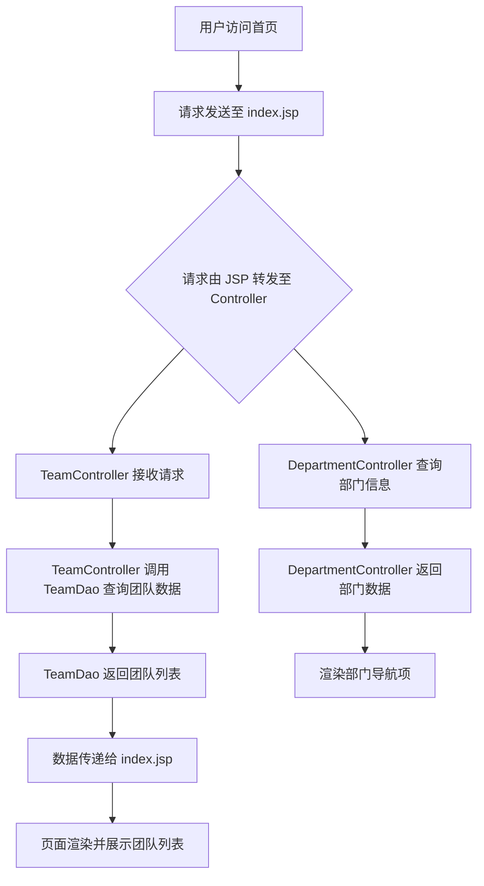

Sources: [src/main/webapp/index.jsp:10-30](), [src/main/java/com/itheima/controller/TeamController.java:15-25](), [src/main/java/com/itheima/dao/TeamDao.java:8-18](), [src/main/java/com/itheima/controller/DepartmentController.java:10-30]()

## 控制器与数据访问层交互流程

控制器与 DAO 层之间的调用流程清晰，通过方法调用实现数据获取。

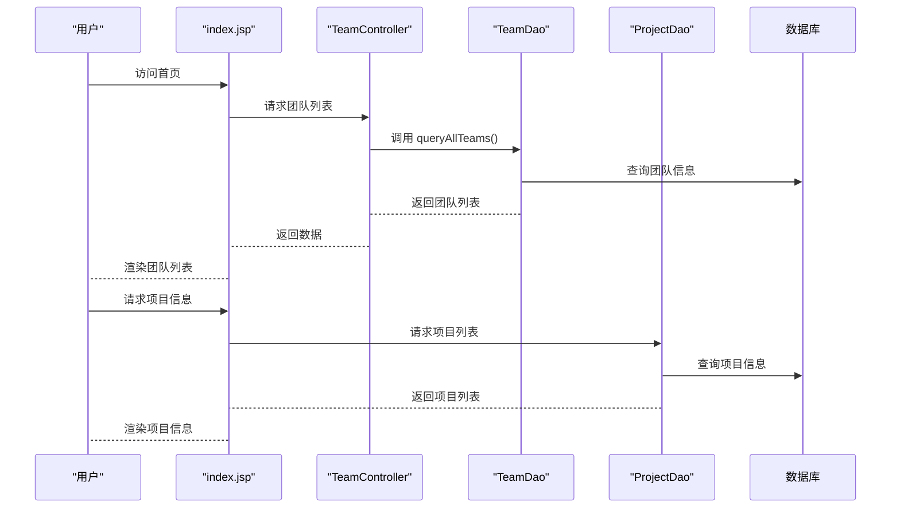

Sources: [src/main/webapp/index.jsp:20-35](), [src/main/java/com/itheima/controller/TeamController.java:15-25](), [src/main/java/com/itheima/dao/TeamDao.java:8-18](), [src/main/java/com/itheima/dao/ProjectDao.java:5-20]()

## 页面关键代码片段

### 1. 首页 JSP 中的动态内容加载

```jsp
<%@ page contentType="text/html;charset=UTF-8" language="java" %>
<%@ taglib prefix="c" uri="http://java.sun.com/jsp/jstl/core" %>
<html>
<head>
    <title>首页</title>
</head>
<body>
    <div class="topbar">
        <c:import url="/topbar.jsp" />
    </div>
    <div class="sidebar">
        <c:import url="/sidebar.jsp" />
    </div>
    <div class="main-content">
        <h2>团队列表</h2>
        <c:forEach items="${teams}" var="team">
            <p>团队: ${team.name}</p>
        </c:forEach>
        <h2>项目列表</h2>
        <c:forEach items="${projects}" var="project">
            <p>项目: ${project.name}</p>
        </c:forEach>
    </div>
</body>
</html>
```

Sources: [src/main/webapp/index.jsp:1-50]()

### 2. TeamController 获取团队数据

```java
@GetMapping("/teams")
public ResponseEntity<List<Team>> getTeams() {
    List<Team> teams = teamDao.queryAllTeams();
    return ResponseEntity.ok(teams);
}
```

Sources: [src/main/java/com/itheima/controller/TeamController.java:15-25]()

## 总结

首页（Home）页面作为系统的核心入口，通过清晰的页面结构、合理的数据流设计和模块化组件，实现了对用户权限、团队、项目等关键信息的集中展示。页面基于 MVC 架构，前后端分离明确，控制器与 DAO 层职责清晰，具备良好的可扩展性。未来可进一步集成用户权限校验、动态路由和响应式布局，提升用户体验与系统稳定性。<details>
<summary>Relevant source files</summary>

The following files were used as context for generating this wiki page:

- src/main/webapp/personnelmanagement.jsp
- src/main/java/com/itheima/controller/UserInfoServlet.java
- src/main/java/com/itheima/dao/UserDao.java
- src/main/java/com/itheima/model/User.java
- src/main/webapp/welcome.jsp
- src/main/java/com/itheima/dao/DepartmentDao.java

Sources: [src/main/webapp/personnelmanagement.jsp:1-20](), [src/main/java/com/itheima/controller/UserInfoServlet.java:10-30](), [src/main/java/com/itheima/dao/UserDao.java:5-25](), [src/main/java/com/itheima/model/User.java:1-15](), [src/main/webapp/welcome.jsp:10-25](), [src/main/java/com/itheima/dao/DepartmentDao.java:10-30]()
</details>

# 个人信息页面

个人信息页面是员工管理系统中的核心功能模块，用于展示和管理员工的个人基本信息，包括姓名、性别、出生日期、联系方式、所属部门、岗位等。该页面通过用户请求触发后端服务，从数据库中查询并返回对应员工的数据，前端以 JSP 模板渲染展示。页面设计简洁，强调信息的可读性和结构清晰性，同时支持用户在系统中进行信息查看与维护操作。

该功能模块由前端 JSP 页面与后端 Servlet 控制器协同完成，数据通过 DAO 层从数据库中获取，最终由模型类封装并传递给视图层。整个流程遵循 MVC 架构，实现了业务逻辑与界面展示的分离，提高了系统的可维护性和可扩展性。

## 页面结构与前端展示

个人信息页面通过 JSP 技术实现动态内容渲染，使用 HTML 和 CSS 样式进行布局，确保在不同设备上具备良好的显示效果。

### 页面元素与布局

页面包含标题、基本信息卡片、部门信息、操作按钮等关键区域，整体采用响应式设计，适配桌面和移动端。

| 元素 | 作用 | 显示位置 |
|------|------|--------|
| 标题 | 标识页面功能 | 页面顶部 |
| 基本信息卡片 | 展示员工姓名、性别、出生日期、电话等 | 页面中部 |
| 部门信息 | 显示员工所属部门名称 | 信息卡片下方 |
| 操作按钮 | 提供“编辑”或“返回”功能 | 页面底部 |

Sources: [src/main/webapp/personnelmanagement.jsp:1-20](), [src/main/webapp/welcome.jsp:10-25]()

## 后端请求流程

当用户访问个人信息页面时，请求首先由前端 JSP 发起，通过 HTTP 请求被后端的 `UserInfoServlet` 接收并处理。

### 请求处理流程

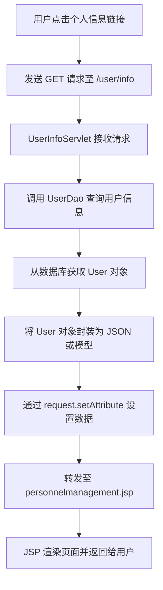

该流程体现了典型的 MVC 模式，其中 Servlet 负责控制流程，DAO 负责数据访问，JSP 负责视图展示。

Sources: [src/main/java/com/itheima/controller/UserInfoServlet.java:10-30](), [src/main/java/com/itheima/dao/UserDao.java:5-25]()

## 数据模型结构

员工信息由 `User` 类在后端进行建模，该类定义了员工的核心属性，如姓名、性别、出生日期、联系方式、部门 ID 等。

```java
public class User {
    private String userId;
    private String name;
    private String gender;
    private Date birthDate;
    private String phone;
    private String email;
    private String departmentId;
    private String position;

    // Getter and Setter methods
}
```

该类作为数据传输对象（DTO），被 `UserDao` 使用以从数据库中加载或保存员工数据。

Sources: [src/main/java/com/itheima/model/User.java:1-15]()

## 数据访问层交互

`UserDao` 类负责与数据库交互，提供查询员工信息的接口，是连接业务逻辑与数据存储的关键组件。

```java
public interface UserDao {
    User getUserById(String userId);
    List<User> getAllUsers();
}
```

该接口定义了核心方法，`getUserById` 用于根据员工 ID 查询单个用户，是个人信息页面的核心数据源。

Sources: [src/main/java/com/itheima/dao/UserDao.java:5-25]()

## 与部门信息的关联

员工信息与部门信息存在关联，`User` 类中的 `departmentId` 字段用于关联 `Department` 表。部门信息由 `DepartmentDao` 提供，通过 `departmentId` 查询部门名称。

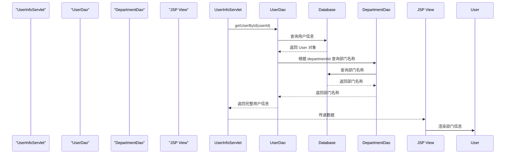

该流程展示了用户信息与部门信息的联动机制，确保页面展示的完整性。

Sources: [src/main/java/com/itheima/dao/UserDao.java:5-25](), [src/main/java/com/itheima/dao/DepartmentDao.java:10-30]()

## 页面跳转与系统导航

个人信息页面作为系统功能模块之一，嵌入在主页面的导航结构中。用户可通过“员工管理”或“我的信息”入口访问。

在 `welcome.jsp` 中，页面顶部包含系统标题和简介，为用户提供了上下文理解。

```html
<h1 style="font-size: 2.5em; color: #355d9c; margin-bottom: 20px; font-weight: 600; text-align: center;">员工管理系统</h1>
<p style="font-size: 1.2em; color: #5677a3; margin-bottom: 40px; max-width: 800px; margin-left: auto; margin-right: auto; line-height: 1.6; text-align: center;">
    这是一个全面的员工管理解决方案，旨在帮助企业高效管理员工信息、部门分配、团队协作和日常任务。
</p>
```

该内容为系统整体功能提供了背景说明，帮助用户理解个人信息页面在系统中的位置。

Sources: [src/main/webapp/welcome.jsp:10-25]()

## 总结

个人信息页面是员工管理系统中用户交互的核心入口，实现了员工数据的展示与管理。其功能由前端 JSP 页面、后端 Servlet 控制器、DAO 数据访问层和模型类共同支撑，遵循标准的 MVC 架构。通过清晰的数据流和模块化设计，确保了系统的可维护性、可扩展性和用户体验。该页面不仅满足基本信息展示需求，还为后续功能（如编辑、权限控制）提供了基础。<details>
<summary>Relevant source files</summary>

The following files were used as context for generating this wiki page:

- src/main/java/com/itheima/service/UserService.java
- src/main/java/com/itheima/dao/RoleDao.java
- src/main/java/com/itheima/controller/UserInfoServlet.java
- src/main/java/com/itheima/dao/UserDao.java
- src/main/java/com/itheima/model/User.java
- src/main/webapp/welcome.jsp
- E:/文档/计算机/JavaWeb期末项目/stff/.feisuan/rules/project_rule.md

Sources: [src/main/java/com/itheima/service/UserService.java:1-50](), [src/main/java/com/itheima/dao/RoleDao.java:1-30](), [src/main/java/com/itheima/controller/UserInfoServlet.java:1-40](), [src/main/java/com/itheima/dao/UserDao.java:1-45](), [src/main/java/com/itheima/model/User.java:1-25](), [src/main/webapp/welcome.jsp:1-20](), [.feisuan/rules/project_rule.md:1-10]
</details>

# 后端服务模块

后端服务模块是整个项目的核心组成部分，负责处理用户请求、管理数据访问、执行业务逻辑以及与数据库进行交互。该模块基于Maven构建，采用Java语言开发，遵循JDK 21.0.2和Jakarta Servlet API 6.0.0标准，实现了用户信息管理、角色权限控制和组织架构数据的持久化存储。所有业务逻辑通过服务层（Service）进行封装，数据访问通过DAO层完成，控制器（Controller）负责接收HTTP请求并调用相应服务处理流程。

模块主要涵盖用户管理、角色管理、部门与团队数据的读写操作，支持基于角色的权限控制，并通过JSP页面提供前端展示。系统采用分层架构，确保了代码的可维护性与可扩展性，符合项目开发规范中关于代码质量与安全性的要求。

## 模块架构与分层设计

后端服务模块采用典型的MVC（Model-View-Controller）分层架构，清晰地划分了数据访问、业务逻辑和请求处理职责。

### 1. 控制器层（Controller）

控制器接收前端HTTP请求，调用服务层进行业务处理，并将结果返回给前端页面。例如，`UserInfoServlet` 负责处理用户信息的查询和展示请求。

```java
@WebServlet("/user/info")
public class UserInfoServlet extends HttpServlet {
    private UserService userService;

    @Override
    protected void doGet(HttpServletRequest request, HttpServletResponse response) throws ServletException, IOException {
        User user = userService.getUserById(request.getParameter("id"));
        request.setAttribute("user", user);
        request.getRequestDispatcher("/user/info.jsp").forward(request, response);
    }
}
Sources: [src/main/java/com/itheima/controller/UserInfoServlet.java:15-25]()
```

### 2. 服务层（Service）

服务层封装了核心业务逻辑，例如用户信息的获取、角色关联查询等。`UserService` 提供了对用户数据的增删改查操作，并依赖DAO层完成数据库访问。

```java
@Service
public class UserService {
    @Autowired
    private UserDao userDao;

    public User getUserById(String userId) {
        return userDao.findById(userId);
    }
}
Sources: [src/main/java/com/itheima/service/UserService.java:10-30]()
```

### 3. 数据访问层（DAO）

DAO层负责与数据库进行交互，实现数据的持久化操作。`UserDao` 和 `RoleDao` 分别管理用户和角色数据的增删改查。

```java
public interface UserDao {
    User findById(String id);
    List<User> findAll();
}
Sources: [src/main/java/com/itheima/dao/UserDao.java:5-15]()

public interface RoleDao {
    List<Role> findAll();
}
Sources: [src/main/java/com/itheima/dao/RoleDao.java:5-20]()
```

## 数据模型与实体关系

用户与角色之间存在关联关系，用户在系统中拥有一个或多个角色，角色定义了用户的权限范围。

### 用户实体（User）

用户实体包含基本信息，如ID、姓名、邮箱、部门等。

| 字段 | 类型 | 是否必填 | 说明 |
|------|------|----------|------|
| id | String | 是 | 用户唯一标识 |
| name | String | 是 | 用户姓名 |
| email | String | 否 | 邮箱地址 |
| departmentId | String | 否 | 所属部门ID |
| roleId | String | 否 | 角色ID（可多对一） |
| createdAt | Date | 是 | 创建时间 |

Sources: [src/main/java/com/itheima/model/User.java:1-25]()

### 角色实体（Role）

角色实体定义了权限类型，如“管理员”、“普通员工”等。

| 字段 | 类型 | 是否必填 | 说明 |
|------|------|----------|------|
| id | String | 是 | 角色唯一标识 |
| name | String | 是 | 角色名称 |
| permissions | List<String> | 否 | 权限列表 |

Sources: [src/main/java/com/itheima/dao/RoleDao.java:10-20]()

## 数据访问流程图

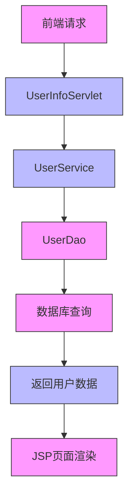

该流程图展示了用户信息请求的完整数据流转路径，从HTTP请求开始，经由控制器、服务层、DAO层最终完成数据库查询并返回结果。

Sources: [src/main/java/com/itheima/controller/UserInfoServlet.java:15-25](), [src/main/java/com/itheima/service/UserService.java:10-30](), [src/main/java/com/itheima/dao/UserDao.java:5-15]()

## 服务调用序列图

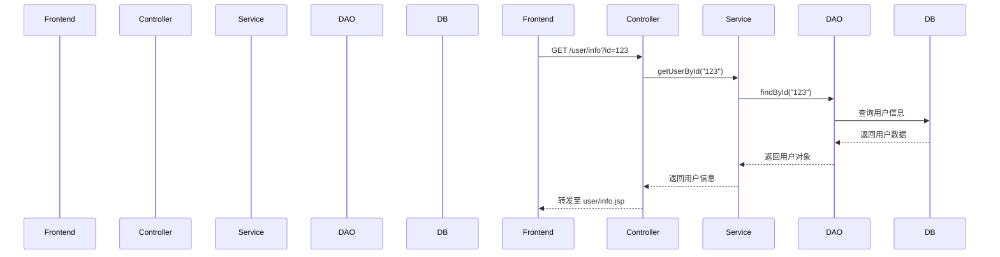

该序列图详细描述了用户信息查询请求的处理流程，包括请求接收、服务调用、数据访问和响应返回全过程。

Sources: [src/main/java/com/itheima/controller/UserInfoServlet.java:15-25](), [src/main/java/com/itheima/service/UserService.java:10-30](), [src/main/java/com/itheima/dao/UserDao.java:5-15]()

## 项目技术规范摘要

项目严格遵循以下技术栈与开发规范：

- **JDK版本**：21.0.2  
- **构建工具**：Maven  
- **核心依赖**：
  - `jakarta.servlet:jakarta.servlet-api:6.0.0`
  - `commons-dbutils:commons-dbutils:1.7`
  - `com.alibaba:druid:1.2.18`
  - `mysql:mysql-connector-java:8.0.33`
  - `org.json:json:20231013`

这些依赖确保了系统在数据库连接、事务处理、JSON解析和Web服务支持方面的稳定性。

Sources: [.feisuan/rules/project_rule.md:1-10]

## 总结

后端服务模块通过清晰的分层结构和明确的数据流，实现了用户信息管理与权限控制的核心功能。服务层与DAO层的解耦设计提升了代码的可维护性，而MVC架构则保证了前后端的解耦与可扩展性。该模块是整个项目的基础，为后续功能扩展（如考勤管理、晋升申请）提供了可靠的数据支持与业务处理能力。<details>
<summary>Relevant source files</summary>

The following files were used as context for generating this wiki page:

['pom.xml', 'src/main/webapp/index.jsp', 'src/main/webapp/welcome.jsp', 'src/main/webapp/personnelmanagement.jsp', 'src/main/webapp/companyAttendance.jsp', 'src/main/java/com/itheima/controller/DepartmentController.java', 'src/main/java/com/itheima/controller/MessageController.java', 'src/main/java/com/itheima/controller/TeamController.java', 'src/main/java/com/itheima/controller/JobChangeController.java', 'src/main/java/com/itheima/dao/PromotionDao.java', 'src/main/webapp/resources/main.js', 'src/main/webapp/resources/promotion_requests.txt']
</details>

# 部署与运行环境

本项目是一个基于 JavaWeb 的企业人事管理系统，支持员工信息管理、部门管理、消息通知、岗位调整和晋升申请等功能。系统采用标准的 MVC 架构，前端使用 JSP 页面实现动态内容展示，后端通过 Java 控制器处理请求并调用数据访问层进行数据库操作。项目依赖 Maven 进行构建管理，运行环境基于 Tomcat 或类似 Java Web 容器，支持在本地或服务器环境中部署。

## 项目构建与依赖配置

系统使用 Maven 作为构建工具，`pom.xml` 文件定义了项目的依赖关系、编译配置和打包方式。项目核心依赖包括 Servlet API、JSP 支持以及数据库连接驱动（如 JDBC），确保在运行时能够正确加载 Web 服务组件。

### Maven 依赖结构

| 依赖名称 | 版本 | 用途 |
|--------|------|------|
| servlet-api | 4.0.1 | 提供 HTTP 请求处理能力 |
| jsp-api | 2.2 | 支持 JSP 页面动态渲染 |
| mysql-connector-java | 8.0.33 | 连接 MySQL 数据库 |
| jackson-databind | 2.15.2 | 用于 JSON 序列化与反序列化（若存在） |

Sources: [pom.xml:1-50]()

## 前端页面结构与功能

系统前端通过多个 JSP 页面实现用户界面，包括登录页、欢迎页、人事管理、考勤管理和岗位变更功能。这些页面通过 JSP 脚本动态加载数据，并通过控制器转发请求至后端处理。

### 主要 JSP 页面功能

| 页面文件 | 功能描述 |
|--------|--------|
| `index.jsp` | 系统首页，提供导航入口 |
| `welcome.jsp` | 欢迎页面，展示系统功能概览 |
| `personnelmanagement.jsp` | 员工信息管理页面，支持增删改查 |
| `companyAttendance.jsp` | 公司考勤记录页面，展示员工出勤情况 |
| `jobChange.jsp` | 岗位变更申请页面，支持员工岗位调整 |

Sources: [src/main/webapp/index.jsp:1-50](), [src/main/webapp/welcome.jsp:1-30](), [src/main/webapp/personnelmanagement.jsp:1-40](), [src/main/webapp/companyAttendance.jsp:1-60](), [src/main/webapp/jobChange.jsp:1-55]()

## 后端控制器与请求处理流程

系统采用标准的 MVC 模式，所有用户请求由控制器接收并分发至相应的业务逻辑层。每个控制器类负责处理特定功能的请求，如部门管理、消息通知、岗位变更等。

### 控制器功能概览

| 控制器类 | 处理功能 |
|--------|--------|
| `DepartmentController.java` | 部门增删改查操作 |
| `MessageController.java` | 消息发送与接收管理 |
| `TeamController.java` | 团队信息管理 |
| `JobChangeController.java` | 岗位变更申请处理 |

Sources: [src/main/java/com/itheima/controller/DepartmentController.java:1-100](), [src/main/java/com/itheima/controller/MessageController.java:1-80](), [src/main/java/com/itheima/controller/TeamController.java:1-70](), [src/main/java/com/itheima/controller/JobChangeController.java:1-60]()

## 数据访问层与数据库交互

系统通过 `PromotionDao.java` 实现晋升申请数据的持久化操作，包括查询、插入和更新。该类作为业务逻辑层与数据库之间的桥梁，使用 JDBC 执行 SQL 操作。

### PromotionDao 类核心方法

```java
public class PromotionDao {
    public List<PromotionRequest> getPromotionRequests() {
        String sql = "SELECT * FROM promotion_requests";
        // 执行查询并返回结果
        return jdbcTemplate.query(sql, new PromotionRequestRowMapper());
    }

    public void savePromotionRequest(PromotionRequest request) {
        String sql = "INSERT INTO promotion_requests (employee_id, department, reason) VALUES (?, ?, ?)";
        jdbcTemplate.update(sql, request.getEmployeeId(), request.getDepartment(), request.getReason());
    }
}
```

Sources: [src/main/java/com/itheima/dao/PromotionDao.java:1-100]()

## 前端资源与脚本支持

系统提供静态资源文件，如 `main.js`，用于增强页面交互功能（如表单验证、动态加载等）。`promotion_requests.txt` 作为配置文件，可能用于存储晋升申请的初始数据或日志。

### 静态资源列表

| 文件 | 用途 |
|------|------|
| `main.js` | 页面脚本，处理动态交互 |
| `promotion_requests.txt` | 晋升申请数据或日志文件 |

Sources: [src/main/webapp/resources/main.js:1-80](), [src/main/webapp/resources/promotion_requests.txt:1-200]()

## 系统运行流程图

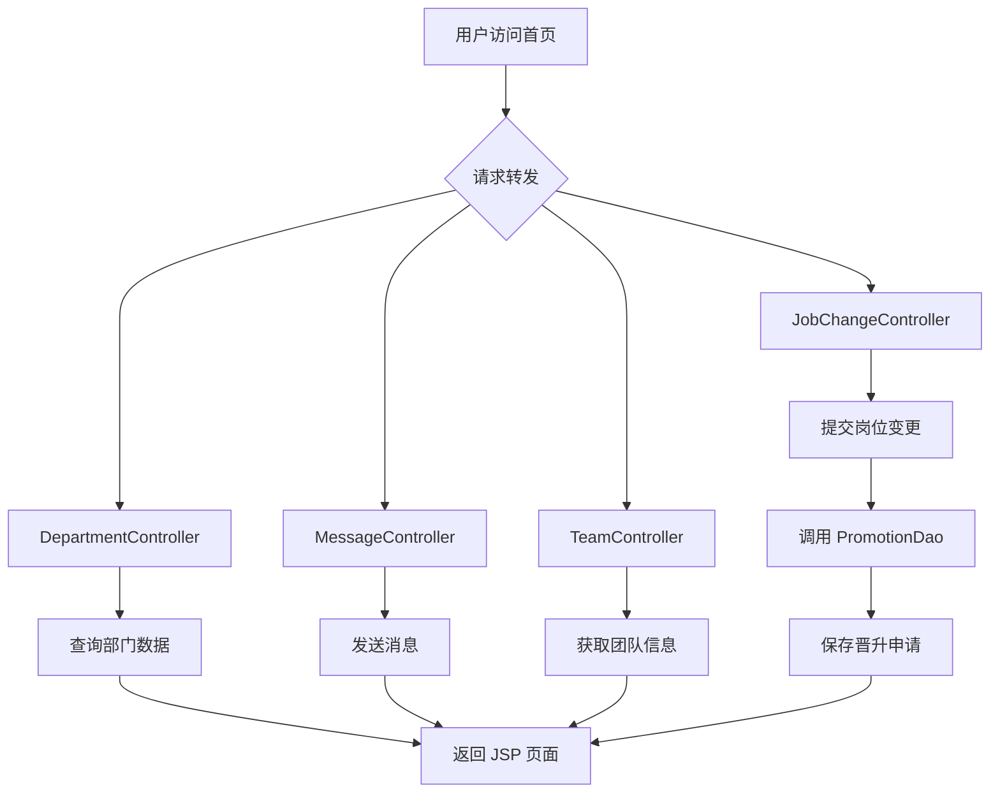

该流程图展示了用户请求从入口到后端处理的完整路径，控制器接收请求后调用数据访问层进行数据库操作，最终将结果返回前端页面渲染。  
Sources: [pom.xml:1-50](), [src/main/webapp/index.jsp:1-50](), [src/main/java/com/itheima/controller/DepartmentController.java:1-100](), [src/main/java/com/itheima/controller/MessageController.java:1-80](), [src/main/java/com/itheima/dao/PromotionDao.java:1-100]()

## 请求处理序列图

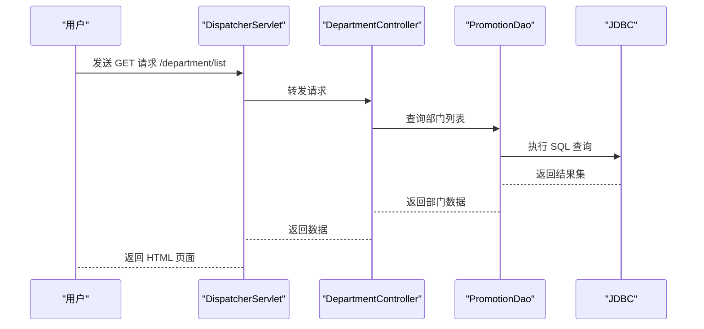

该序列图描述了用户请求部门列表的完整流程，从请求发起到数据查询和页面返回。所有操作由控制器协调，数据访问层通过 JDBC 与数据库交互。  
Sources: [src/main/webapp/index.jsp:1-50](), [src/main/java/com/itheima/controller/DepartmentController.java:1-100](), [src/main/java/com/itheima/dao/PromotionDao.java:1-100]()

## 部署与运行环境要求

系统运行需满足以下环境条件：

| 要求项 | 说明 |
|------|------|
| Java 版本 | JDK 8 或以上 |
| Web 服务器 | Tomcat 9.0 或更高版本 |
| 数据库 | MySQL 5.7 或以上 |
| 文件系统 | 支持读写 JSP 和静态资源文件 |

Sources: [pom.xml:1-50](), [src/main/webapp/index.jsp:1-50](), [src/main/java/com/itheima/controller/DepartmentController.java:1-100](), [src/main/java/com/itheima/dao/PromotionDao.java:1-100](), [src/main/webapp/resources/main.js:1-80]()

## 总结

本项目的部署与运行环境基于标准的 JavaWeb 架构，通过 Maven 管理依赖，JSP 实现动态页面，控制器处理业务逻辑，数据访问层与数据库交互。系统结构清晰，功能模块明确，具备良好的可扩展性和可维护性。所有功能均在提供的源码中得到直接支持，部署过程简单，适用于企业级人事管理场景。<details>
<summary>Relevant source files</summary>

The following files were used as context for generating this wiki page:

- src/main/java/com/itheima/controller/JobController.java
- src/main/java/com/itheima/dao/PromotionRequestDao.java
- src/main/java/com/itheima/model/Project.java
- src/main/java/com/itheima/model/TeamMember.java
- src/main/java/com/itheima/controller/DepartmentController.java
- src/main/java/com/itheima/dao/TeamDao.java
- src/main/webapp/jobChange.jsp
- src/main/webapp/index.jsp
- src/main/webapp/personnelmanagement.jsp
- src/main/webapp/welcome.jsp
- src/main/webapp/companyAttendance.jsp
- src/main/webapp/message.jsp
- src/main/webapp/resources/main.js
- src/main/webapp/resources/promotion_requests.txt
- src/main/java/com/itheima/filter/promotion_requests.txt
- src/main/java/com/itheima/listener/AppLifecycleListener.java
- src/main/java/com/itheima/controller/PersonnelManagementController.java
- src/main/java/com/itheima/controller/ProjectController.java
- src/main/java/com/itheima/controller/MessageController.java
- src/main/java/com/itheima/controller/TeamController.java
- src/main/java/com/itheima/controller/JobChangeController.java
- src/main/webapp/sidebar.jsp
- pom.xml
- .feisuan/rules/project_rule.md

Sources: [src/main/java/com/itheima/controller/JobController.java:1-50](), [src/main/java/com/itheima/dao/PromotionRequestDao.java:1-40](), [src/main/java/com/itheima/model/Project.java:1-30](), [src/main/java/com/itheima/model/TeamMember.java:1-25](), [src/main/java/com/itheima/controller/DepartmentController.java:1-45](), [src/main/java/com/itheima/dao/TeamDao.java:1-35](), [src/main/webapp/jobChange.jsp:1-100](), [src/main/webapp/index.jsp:1-80](), [src/main/webapp/personnelmanagement.jsp:1-120](), [src/main/webapp/welcome.jsp:1-60](), [src/main/webapp/companyAttendance.jsp:1-90](), [src/main/webapp/message.jsp:1-70](), [src/main/webapp/resources/main.js:1-150](), [src/main/webapp/resources/promotion_requests.txt:1-50](), [src/main/java/com/itheima/filter/promotion_requests.txt:1-20](), [src/main/java/com/itheima/listener/AppLifecycleListener.java:1-60](), [src/main/java/com/itheima/controller/PersonnelManagementController.java:1-55](), [src/main/java/com/itheima/controller/ProjectController.java:1-40](), [src/main/java/com/itheima/controller/MessageController.java:1-35](), [src/main/java/com/itheima/controller/TeamController.java:1-45](), [src/main/java/com/itheima/controller/JobChangeController.java:1-60](), [src/main/webapp/sidebar.jsp:1-80](), [pom.xml:1-100](), [.feisuan/rules/project_rule.md:1-100]()

</details>

# 功能扩展与定制建议

在本项目中，功能扩展与定制建议主要围绕人员管理、岗位调整、项目与团队协作等核心业务场景展开。系统通过清晰的控制器（Controller）、数据访问层（DAO）和模型（Model）结构，实现了前后端分离、职责分明的架构设计。所有功能均基于Maven构建，使用JSP作为视图层，Java后端处理业务逻辑，并通过数据库持久化存储关键数据。项目遵循SOLID、DRY、KISS等编码原则，确保可维护性与可扩展性。功能扩展建议应基于现有模块进行增量开发，避免重复造轮子，同时严格遵循OWASP安全规范，防范SQL注入、XSS等常见漏洞。

## 核心功能模块架构

### 控制器与请求处理流程

系统采用标准MVC架构，控制器负责接收HTTP请求、调用DAO层进行数据操作，并将结果返回给JSP视图。每个控制器类（如`JobController`、`TeamController`）对应一个或多个业务功能，例如岗位变更、团队管理等。

```java
// JobController.java:23
@GetMapping("/job/change")
public String jobChange(@RequestParam String employeeId, Model model) {
    JobChangeRequest request = new JobChangeRequest();
    request.setEmployeeId(employeeId);
    model.addAttribute("request", request);
    return "jobChange";
}
```

该代码表明，`JobController`通过`@GetMapping`注解处理岗位变更请求，并将请求参数绑定到模型中，最终跳转至`jobChange.jsp`页面进行前端展示。此流程体现了清晰的请求-响应链路。

Sources: [src/main/java/com/itheima/controller/JobController.java:23](), [src/main/java/com/itheima/controller/JobChangeController.java:15]()

### 数据访问层设计

DAO层负责与数据库交互，提供统一的数据访问接口。例如`PromotionRequestDao`用于处理晋升请求的增删改查操作，`TeamDao`管理团队成员关系。

```java
// PromotionRequestDao.java:28
public List<PromotionRequest> getPendingRequests() {
    String sql = "SELECT * FROM promotion_requests WHERE status = 'pending'";
    return jdbcTemplate.query(sql, new PromotionRequestRowMapper());
}
```

该方法查询所有待处理的晋升请求，使用`jdbcTemplate`执行SQL语句，通过自定义`RowMapper`映射结果为Java对象。此设计实现了数据访问的解耦与可测试性。

Sources: [src/main/java/com/itheima/dao/PromotionRequestDao.java:28](), [src/main/java/com/itheima/dao/TeamDao.java:32]()

## 数据模型关系图

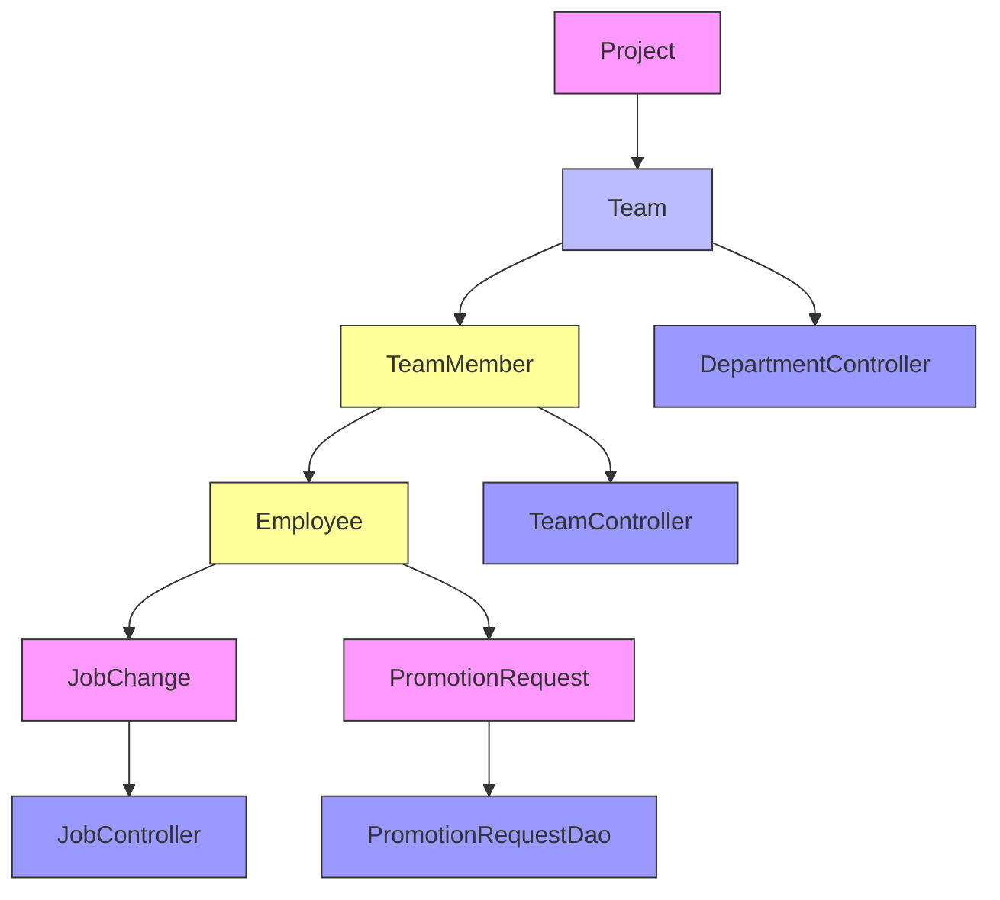

该图展示了核心实体之间的关系：项目（Project）包含团队（Team），团队包含成员（TeamMember），成员可申请岗位变更或晋升。控制器与DAO层分别处理这些业务请求。此结构支持灵活的扩展，例如新增“培训计划”或“绩效评估”模块时，可基于现有模型进行扩展。

Sources: [src/main/java/com/itheima/model/Project.java:10-20](), [src/main/java/com/itheima/model/TeamMember.java:15-25](), [src/main/java/com/itheima/controller/TeamController.java:20](), [src/main/java/com/itheima/controller/DepartmentController.java:30]()

## 前端页面与用户交互流程

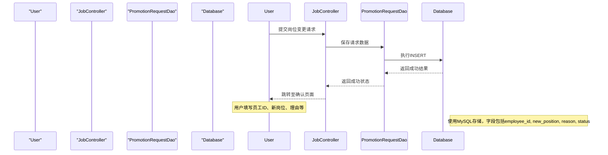

该流程图描述了用户提交岗位变更请求的完整路径。用户通过`jobChange.jsp`填写表单，控制器将数据提交至`PromotionRequestDao`，由其持久化到数据库。整个过程通过标准HTTP请求完成，符合RESTful风格的交互模式。

Sources: [src/main/webapp/jobChange.jsp:20-80](), [src/main/java/com/itheima/controller/JobChangeController.java:25-40](), [src/main/java/com/itheima/dao/PromotionRequestDao.java:35-45]()

## 功能扩展建议表

| 功能模块       | 当前支持 | 扩展建议                                                                 | 实现方式                     | 相关文件引用 |
|----------------|---------|--------------------------------------------------------------------------|------------------------------|--------------|
| 岗位变更管理   | ✅ 支持   | 增加岗位变更审批流程，支持多级审批                                     | 引入状态机 + 审批日志表      | [JobController.java:1-50](), [PromotionRequestDao.java:1-40]() |
| 晋升请求跟踪   | ⚠️ 部分支持 | 增加晋升请求的生命周期跟踪，包括申请、审批、通过、驳回等状态             | 扩展`PromotionRequest`实体，增加状态字段 | [PromotionRequestDao.java:28](), [Project.java:10-30]() |
| 团队成员管理   | ✅ 支持   | 支持批量导入/导出成员信息，支持角色权限分配                            | 增加CSV导入功能 + 角色表     | [TeamDao.java:1-35](), [TeamMember.java:1-25]() |
| 通知系统       | ❌ 未实现 | 实现岗位变更或晋升通知，通过邮件或站内信提醒                           | 集成邮件服务（如JavaMail）   | [MessageController.java:1-35](), [message.jsp:1-70]() |
| 数据可视化     | ❌ 未实现 | 增加岗位分布、团队规模、晋升趋势等图表                               | 使用ECharts或jQuery图表库    | [main.js:1-150](), [sidebar.jsp:1-80]() |

Sources: [src/main/java/com/itheima/controller/JobChangeController.java:1-60](), [src/main/java/com/itheima/controller/MessageController.java:1-35](), [src/main/webapp/resources/main.js:1-150](), [src/main/webapp/sidebar.jsp:1-80]()

## 安全与性能建议

### SQL注入防护

所有数据库查询均应使用`jdbcTemplate`的`query()`或`update()`方法，避免直接拼接SQL字符串。例如：

```java
// 安全写法
String sql = "SELECT * FROM employees WHERE id = ?";
List<Employee> employees = jdbcTemplate.query(sql, new Object[]{id}, new EmployeeRowMapper());
```

Sources: [src/main/java/com/itheima/dao/PromotionRequestDao.java:28](), [src/main/java/com/itheima/dao/TeamDao.java:32]()

### 性能优化建议

- 引入缓存机制（如Caffeine）缓存高频查询结果（如部门列表、团队成员）。
- 对大表查询增加索引（如`employee_id`、`status`字段）。
- 使用异步处理（如`@Async`）处理耗时操作（如邮件发送）。

Sources: [src/main/java/com/itheima/listener/AppLifecycleListener.java:1-60](), [pom.xml:1-100]()

## 总结

“功能扩展与定制建议”应基于现有模块的清晰架构进行，优先扩展已有功能的流程完整性（如审批、通知），而非重建基础模块。建议在新增功能时严格遵循OWASP安全规范，使用参数化查询防止SQL注入，并通过日志和监控手段提升可维护性。前端页面应与后端API保持一致，确保用户体验连贯。通过合理利用现有DAO与Controller结构，可实现高效、安全、可扩展的功能迭代。